# Image Rendering Issue - Summary Report

## Problem Overview

**Status:** Identified and Solvable  
**Severity:** High (blocks core feature)  
**Root Cause:** Invalid/Expired GEMINI_API_KEY causing failed image generations

---

## Visual Evidence

### Screenshot 1: Vision Gallery with Failed Image Loads

**What we see:**
- Multiple vision board images failing to load
- Each image shows placeholder/broken image
- Same vision prompt repeated across multiple cards
- Gallery UI showing "1001 Visions Saved" but images not displaying

### Screenshot 2: Console Errors

**Critical Findings:**
- **Malformed URLs:** `edazpjnncr/yxcrhoocct.afcd-b8031eb/7550c.1`
- **Expected Format:** `https://{project}.supabase.co/storage/v1/object/public/visions/...`
- **Error:** "Failed to load resource: the server responded with a status of 400 ()"
- Multiple instances of the same error

---

## Technical Analysis

### 1. Image Generation Flow

```mermaid
graph LR
    A[User Creates Vision] --> B[Call gemini-proxy Edge Function]
    B --> C{GEMINI_API_KEY Valid?}
    C -->|Yes| D[Generate Image with Gemini]
    C -->|No| E[❌ API Error]
    D --> F[Upload to Supabase Storage]
    F --> G[Save URL to Database]
    E --> H[💥 Corrupted URL in Database]
    G --> I[✅ Valid URL in Database]
    H --> J[Gallery Shows Broken Images]
    I --> K[Gallery Shows Images]
```

### 2. Your Current State

Your app is at step **H** - corrupted URLs in the database from failed API calls.

### 3. API Key Locations

| Location | Secret Name | Status |
|----------|-------------|---------|
| Supabase Edge Functions | `GEMINI_API_KEY` | ⚠️ Likely Invalid |
| Vercel (if deployed) | `GEMINI_API_KEY` | ℹ️ Not checked |

**Note:** You mentioned having "two Gemini API secrets" in Supabase. If you see duplicates:
- `GEMINI_API_KEY` ← This is the one used by `gemini-proxy`
- `Gemini API` ← May be unused/old duplicate

---

## Solution Summary

### Phase 1: Diagnosis (5 minutes)
✅ Run diagnostic script to validate API key  
📊 Review which Gemini models are accessible

### Phase 2: Fix API Key (5 minutes, if needed)
🔑 Create new Gemini API key  
🔧 Update `GEMINI_API_KEY` in Supabase secrets  
✅ Verify with diagnostic script

### Phase 3: Database Cleanup (5 minutes)
🗑️ Identify corrupted vision_boards entries  
💾 Create backup of corrupted data  
🧹 Delete entries with malformed URLs

### Phase 4: Verification (5 minutes)
🎨 Generate test vision image  
🖼️ Verify image displays in gallery  
✅ Confirm no console errors

---

## Files Created for You

| File | Purpose |
|------|---------|
| [`implementation_plan.md`](file:///C:/Users/mover/.gemini/antigravity/brain/63939883-346f-4493-8106-a17524b6a375/implementation_plan.md) | Detailed technical plan |
| [`walkthrough.md`](file:///C:/Users/mover/.gemini/antigravity/brain/63939883-346f-4493-8106-a17524b6a375/walkthrough.md) | Step-by-step user guide |
| [`diagnostic_script.js`](file:///c:/Users/mover/.gemini/antigravity/playground/nebular-lunar/diagnostic_script.js) | Browser console diagnostic |
| [`cleanup_script.sql`](file:///c:/Users/mover/.gemini/antigravity/playground/nebular-lunar/cleanup_script.sql) | Database cleanup queries |

---

## Next Steps

**Start Here:** Open the [walkthrough.md](file:///C:/Users/mover/.gemini/antigravity/brain/63939883-346f-4493-8106-a17524b6a375/walkthrough.md) and follow Step 1.

**Quick Start:**
1. Start your app: `npm run dev`
2. Open in browser and sign in
3. Press F12, paste diagnostic script
4. Follow the recommendations

---

## Questions Answered

> **Should I delete both API keys and create new ones?**

**Answer:** Not necessarily. First run the diagnostic to determine if your current key(s) are valid. If the diagnostic shows "API KEY IS INVALID", then yes, create a new one and update GEMINI_API_KEY in Supabase. If you have duplicate secrets, keep only GEMINI_API_KEY.

> **Is it possible one of these API keys is wrong?**

**Answer:** Yes, very likely! The malformed URLs in your database are a symptom of the Edge Function failing to generate images because the API key is invalid or expired. The diagnostic script will confirm this.

> **Can you help me replace API keys everywhere?**

**Answer:** Yes! The main location is:
- **Supabase Dashboard → Settings → Edge Functions → Secrets → GEMINI_API_KEY**

If you also deployed to Vercel:
- **Vercel Dashboard → Your Project → Settings → Environment Variables → GEMINI_API_KEY**

The walkthrough includes detailed instructions with screenshots for updating these.
