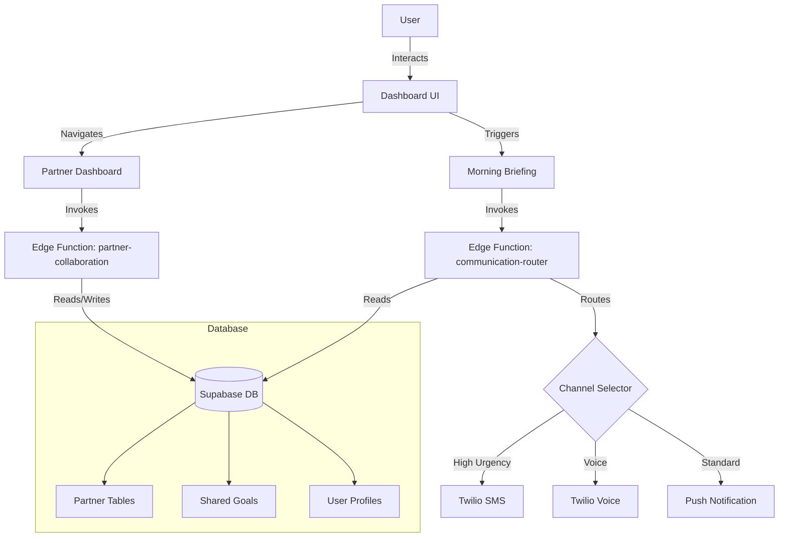

# VISIONARY AI — MASTER PRODUCT & DEVELOPMENT ROADMAP

**Version:** 3.0
**Maintainer:** Milton Overton
**Distribution:** Internal Strategy & Engineering
**Last Updated:** December 24, 2025
**Business Plan Update:** Comprehensive business plan integration with financial projections, market analysis, and go-to-market strategy

---

## Product Mission & Positioning

Visionary AI is the **world's first agentic success platform** combining emotional visualization, financial intelligence, autonomous AI execution, and identity-driven coaching across web, mobile, Apple Watch, voice, and physical print products.

### Mission
Enable ambitious professionals, executives, athletes, families, and teams to achieve goals faster through identity-aligned, AI-driven execution with proactive coaching that acts on your behalf.

### Positioning
> "The world's first identity-driven AI achievement system that doesn't just track your goals — it executes them for you."

### Complete System Capabilities

| Capability | Description | Status |
|------------|-------------|--------|
| **AI Vision Board Generation** | Photorealistic images with likeness preservation using Gemini 2.5 Pro (Nano Banana Pro) | ✅ Production |
| **AMIE Identity Engine** | Adaptive Motivational Identity Engine with 5 psychological themes and RAG-based coaching | ✅ Production |
| **Voice Coach with Agentic Capabilities** | AI voice coaching with auto-listen, function calling, and autonomous task execution | ✅ Production |
| **Financial Intelligence** | Plaid bank integration, retirement gap analysis, cost-of-living projections | ✅ Production |
| **Habit Tracking & Streaks** | Daily micro-actions with streak tracking, achievements, and predictive coaching | ✅ Production |
| **Physical Print Products** | Vision workbooks, posters, habit trackers via Prodigi fulfillment | ✅ Production |
| **Enterprise Team Features** | Slack/Teams bots, team leaderboards, shared goals, manager dashboards | ✅ Production |
| **Manager Dashboard** | Admin controls for AI Coach settings, voice coach analytics, outreach management | ✅ Production |
| **Multi-Channel Communication** | SMS, voice calls, email, push notifications with intelligent routing | ✅ Production |
| **Apple Watch Integration** | Wearable coaching with habit triggers and micro-check-ins | ✅ Production |
| **Knowledge Base (RAG)** | Personal context ingestion from documents, conversations, and user history | ✅ Production |
| **Weekly AI Reviews** | Automated progress summaries with wins, blockers, and AI insights | ✅ Production |
| **Enterprise Security** | RLS hardening, rate limiting, security headers, audit logging | ✅ Production |

---

## Company Overview

### Corporate Information

| Field | Details |
|-------|---------|
| **Company Name** | Visionary AI LLC |
| **Founded** | 2025 |
| **Headquarters** | Clayton, Missouri, USA |
| **Founders** | Milton Overton & Lisa Overton |
| **Legal Structure** | Missouri Limited Liability Company |
| **Industry** | AI-Powered Personal Development & Goal Achievement |

### Company Vision

Visionary AI exists to democratize access to world-class goal achievement systems. We believe that everyone deserves an AI coach that understands their unique identity, values, and aspirations—and actively helps them execute on their vision.

### Core Values

1. **Identity-First** — We build technology that adapts to who you are, not the other way around
2. **Execution Over Intention** — Dreaming is just the start; we help you take action every day
3. **Human + AI Partnership** — AI augments human potential, never replaces human agency
4. **Physical Reinforcement** — Digital tools are powerful; physical products create lasting commitment
5. **Radical Transparency** — Users own their data and understand how AI makes decisions

---

## Target Users & Market Focus

### Core Segments
- Ambitious professionals & entrepreneurs
- Executives & founders
- High-intent couples & families
- Enterprise teams

### Market Categories
- Productivity systems
- Identity & coaching tools
- Financial planning
- Agentic AI workflow automation
- Digital-to-physical execution systems

### Market Sizing

| Market Level | Size | Description |
|--------------|------|-------------|
| **TAM (Total Addressable Market)** | $200B+ | Global wellness, goal-setting, AI coaching, and personal development market |
| **SAM (Serviceable Addressable Market)** | $15B | English-speaking professionals using digital productivity and coaching tools |
| **SOM (Serviceable Obtainable Market)** | $500M | Achievable market share within 3 years through focused positioning |

### Competitive Landscape

| Competitor | Category | Our Advantage |
|------------|----------|---------------|
| **Notion / Miro** | Productivity | We execute goals, not just track them |
| **Canva** | Visual Design | AI-generated personalized vision boards with likeness preservation |
| **Calm / Headspace** | Wellness | Goal-oriented coaching, not just meditation |
| **BetterUp / Noom** | Coaching | 10x more affordable with AI-first approach |
| **Financial Advisors** | Planning | Combines emotional visualization with financial intelligence |

### Why We Win

1. **First-Mover in Agentic Goal Achievement** — No competitor offers AI that takes action on your behalf
2. **Identity-Driven Personalization** — AMIE creates deeper engagement than generic tools
3. **Physical-Digital Loop** — Print products create commitment others can't match
4. **Multi-Channel Coaching** — Watch, voice, SMS, email integration beats single-channel apps

---

## Strategic Differentiators

| Differentiator | Description |
|----------------|-------------|
| **AMIE** | Adaptive Motivational Identity Engine — personalized coaching themes |
| **Agentic Action Engine** | Tasks, calendar, automation on behalf of users |
| **Multi-channel Execution** | Voice, watch, SMS, email, push, in-app |
| **Notebook-LM Style Knowledge Base** | Personal context ingestion from resumes, docs, conversations |
| **Print Ecosystem** | Workbooks, posters, habit pads, sticker sheets |
| **Enterprise Alignment** | Team goals, shared dashboards, Slack/Teams integration |

---

## Product Pillars

1. **Vision & Identity** — AMIE-powered onboarding and theme-based coaching
2. **Financial Planning** — Plaid integration, retirement gap analysis, cost-of-living
3. **Execution & Accountability** — Habits, streaks, action plans, predictive pace warnings
4. **Wearable & Voice Coaching** — Apple Watch companion, Gemini Live voice sessions
5. **Print & Physical Reinforcement** — Workbooks, daily pads, habit cards, posters
6. **Team & Enterprise Enablement** — Shared goals, dashboards, Slack/Teams bots

---

## Project Overview (Legacy Context)
Visionary is a high-end, AI-first SaaS platform designed to help couples and individuals visualize, plan, and manifest their dream retirement. By combining financial reality checks with generative AI vision boarding, Visionary offers a unique emotional and practical approach to retirement planning.

---AI Interactive Vision Board is the first agentic success platform that turns visions into reality by combining emotional visualization, financial intelligence, and autonomous AI execution—backed by physical products that reinforce identity and commitment.

## 1. Public Relations (PR) Plan

### Target Audience
- **Primary:** Affluent couples aged 45-60 planning for retirement.
- **Secondary:** Financial Advisors looking for engagement tools for clients.
- **Niche:** Expats planning to retire abroad (e.g., Thailand, Portugal).

### Key Messaging
- "See your future before you spend it."
- "The first financial tool that understands your dreams, not just your dollars."
- "Powered by Gemini 2.5 & 3.0: The world's most advanced AI for life planning."

### Campaign Phases

#### Phase 1: The "Dream Gap" (Launch Week)
- **Press Release:** Announce Visionary as the solution to the "Dream Gap" (the disconnect between financial savings and lifestyle vision).
- **Asset:** "The Thailand Experiment" - A case study of Milton and Lisa Overton using the platform to visualize their beach-front retirement.
- **Channels:** LinkedIn, TechCrunch (AI vertical), AARP Magazine, Financial Planning Journals.

#### Phase 2: User Stories & Virality (Month 1-3)
- **Feature:** "Vision Board Challenge" - Users share their generated AI vision boards on social media with #MyVisionaryFuture.
- **Influencer Strategy:** Partner with retirement coaches and financial influencers to demo the "Voice-to-Vision" feature.

#### Phase 3: B2B Integration (Month 3-6)
- **Partnership Announcement:** Integration with major wealth management platforms (e.g., Fidelity, Vanguard APIs) to pull real-time data.

---

## 2. Development Roadmap & Status

**Current Version:** v2.9 (December 2025)
**Status:** v1.0-v2.9 COMPLETE. Gemini Live Voice (Feature 23), Plaid balance retrieval, AI Coach Agentic Execution with Human-in-the-Loop confirmation, Google Calendar integration, observability tracing, and gradual rollout infrastructure all production ready.

### 🎉 Recent Major Achievements (December 2025)

**Onboarding Flow Resilience & Error Handling (December 24, 2025):**
- ✅ **Gemini Model Fix** - Changed `gemini-1.5-pro` to `gemini-1.5-flash` in gemini-proxy/index.ts (model was unavailable)
- ✅ **MasterPromptQnA Retry Logic** - Added exponential backoff (up to 2 retries) with automatic fallback to standard questions
- ✅ **Vision Generation Error Handling** - User-friendly error messages for credit exhaustion, rate limits, network issues, safety filters
- ✅ **Vision Error Banner UI** - Retry/Skip buttons in GuidedOnboarding for graceful degradation when generation fails
- ✅ **Microphone Error Handling** - VisionCaptureStep now shows specific error messages for denied, not-found, network, and capture errors
- ✅ **Camera Error Handling** - PhotoUploadStep handles NotAllowedError, NotFoundError, NotReadableError, OverconstrainedError
- ✅ **Edge Function POST Support** - `onboarding-themes` now supports both query params (legacy) and POST body (new approach)
- ✅ **React State Loop Fix** - VisionCaptureStep uses ref pattern to prevent infinite re-render loops
- ✅ **Types Update** - Added 'skipped' to visionGenerationStatus type for graceful degradation

**Last Mile UI Integration (December 24, 2025):**
- ✅ **GoalEditorPage Component** - Standalone goal editor for existing users (wraps DraftPlanReviewStep)
- ✅ **ProgressPredictionWidget** - AI-powered progress predictions with pace tracking, status badges (On Track/Slightly Behind/At Risk), and recommendations
- ✅ **AchievementGallery** - Badge gallery showing unlocked/locked achievements with detail modal and compact dashboard mode
- ✅ **Goals Navigation** - Added 🎯 Goals button to desktop and mobile navigation in App.tsx
- ✅ **Dashboard V2 Integration** - Added Band 3 with ProgressPredictionWidget and AchievementGallery
- ✅ **Database Schema Verified** - action_tasks, progress_predictions, user_achievements tables exist
- ✅ **Database Functions** - calculate_user_progress_prediction, award_achievement, check_streak_achievements
- ✅ **Database Triggers** - Auto-award badges on first vision, first goal, action plan; auto-update predictions on task completion
- ✅ **Migration Tracking Fixed** - Synced Supabase CLI migration history with remote database

**iOS Voice Coach Audio Fix (December 24, 2025):**
- ✅ **iOS Audio Unlock** - Speech synthesis now unlocked via silent utterance on first user tap (before async API calls)
- ✅ **Voice Loading Fix** - Added `voiceschanged` event listener to properly load voices on iOS Safari
- ✅ **Retry Logic** - Automatic retry (up to 2 attempts) when iOS speech synthesis gets stuck
- ✅ **iOS Detection** - Detect iPhone/iPad to apply iOS-specific workarounds
- ✅ **Silent Mode Warning** - Amber banner warns users to check iPhone silent/ringer switch
- ✅ **Cancel Delay** - 100ms delay after `cancel()` for iOS compatibility
- ✅ **Root Cause** - iOS Safari requires `speechSynthesis.speak()` from direct user gesture, not async callback

**Gemini Live Voice & Plaid Integration (December 22, 2025):**
- ✅ **Feature 23: Gemini Live Voice** - Real-time bidirectional voice conversations with AI Coach
- ✅ `gemini-live-session` Edge Function deployed for WebSocket-based voice streaming
- ✅ `geminiLiveService.ts` frontend service for Gemini Live API integration
- ✅ Updated VoiceCoachWidget to support Gemini Live voice sessions
- ✅ **Plaid Balance Retrieval** - Complete implementation of bank account balance fetching
- ✅ `get-plaid-balances` Edge Function deployed for real-time balance queries
- ✅ `plaidService.ts` frontend service for Plaid API integration
- ✅ Added CLAUDE.md project configuration for Claude Code AI assistant

**Voice Coach Production Fix & OpenAI Migration (December 22, 2025):**
- ✅ Migrated Voice Coach AI from Gemini to OpenAI GPT-4o for faster, more intelligent responses
- ✅ Fixed OpenAI API key configuration in Supabase Edge Function secrets
- ✅ Voice Coach now delivers intelligent, contextual responses (verified working)
- ✅ Agent tools executing successfully (create_task, send_email confirmed working)
- ✅ Fixed speech recognition rapid restart loops (300ms delay fix)
- ✅ Fixed infinite loop in useFeatureFlags hook (refs instead of state)
- ✅ Fixed feature_flags schema mismatch (is_enabled vs is_active)
- ✅ Fixed agent tool execution schema mismatches (action_tasks vs action_steps)
- ✅ Added team_id column to agent_action_history table
- ✅ Enhanced error handling for speech recognition (specific error messages)
- 🔲 **IDENTIFIED ISSUE**: Voice Coach cannot reliably capture email addresses via voice recognition
- 🔲 **PLANNED FIX**: Auto-load user profile data, email normalization helper, cross-session memory

**AI Coach Agentic Execution (December 20-21, 2025):**
- ✅ Human-in-the-Loop confirmation flow with pending actions table
- ✅ Risk-based action categorization (low/medium/high/critical)
- ✅ Confidence-based routing with configurable thresholds
- ✅ LangSmith-style execution tracing and observability
- ✅ Google Calendar OAuth integration (connect, events, availability)
- ✅ Agent action feedback capture for continuous improvement
- ✅ Feature flags system for gradual rollout
- ✅ Pending Action Card UI with approve/cancel/expire
- ✅ Agent Activity Dashboard for admin monitoring
- ✅ Enhanced user_agent_settings and team_ai_settings tables
- ✅ 5 new edge functions for calendar and action management
- ✅ Comprehensive error tracking library

**Enterprise Security Hardening (December 19, 2025):**
- ✅ Comprehensive RLS policy audit and hardening across 18+ tables
- ✅ Storage bucket security (removed public access, user-scoped paths)
- ✅ Rate limiting infrastructure with database-backed persistence
- ✅ Security headers (OWASP best practices) on all endpoints
- ✅ Security audit logging (data_access_logs, security_alerts tables)
- ✅ Cross-account access detection with real-time alerts
- ✅ Foreign key constraints for data integrity
- ✅ Rate limit violation tracking and IP blocking capability
- ✅ Fixed critical data bleeding vulnerability in App.tsx
- ✅ Defense-in-depth authorization with verifyOwnershipWithLogging()

**Voice Coach & Agentic Capabilities (December 17, 2025):**
- ✅ Voice Coach with full agentic capabilities and function calling
- ✅ Auto-listen feature for hands-free voice interaction
- ✅ Phase 3 Voice Integration with enhanced session types (morning_routine, check_in, reflection, goal_setting, celebration, accountability, crisis_support)
- ✅ Resilient error handling for voice coach function calls
- ✅ Voice coach resilient to missing AI settings tables

**Manager Dashboard & Admin Controls (December 17, 2025):**
- ✅ Manager Dashboard with AI Coach settings controls
- ✅ Voice Coach Analytics dashboard (admin-get-voice-coach-stats)
- ✅ Outreach Management for scheduling AI-driven communications
- ✅ AI Settings Controls (admin-ai-settings) for platform configuration
- ✅ Credit Management for platform admins

**Phase 3: Engagement & Retention (December 19, 2025):**
- ✅ SMS Scheduling Infrastructure - `sms-scheduler` edge function for processing scheduled reminders
- ✅ Streak Celebration Notifications - `celebrate-streak` edge function with milestone messages (7, 14, 21, 30, 60, 90, 100, 180, 365 days)
- ✅ Outreach Automation Rules - `process-automations` edge function for event-driven automation engine
- ✅ Database tables: `streak_celebrations`, `scheduled_reminders`, `automation_rules`, `automation_executions`
- ✅ Integrated streak celebrations with habit completion flow in `habit-service`
- ✅ Default automation rules trigger for new users (streak celebrations, missed habit reminders, inactivity check-ins)

**Security Hardening (December 19, 2025):**
- ✅ Rate Limiting Infrastructure - `rate_limits`, `rate_limit_configs`, `blocked_ips`, `rate_limit_violations` tables
- ✅ Comprehensive RLS policies for 18+ tables with Row Level Security
- ✅ Storage bucket security policies for avatars, vision-boards, pdfs, audio
- ✅ Platform admin functions with `is_platform_admin()` helper

**Vision Board Engine Fixes (December 15-16, 2025):**
- ✅ Safety compliance rewrite with natural language prompts
- ✅ Critical tag/image mismatch fix for corrupted image generation
- ✅ Image truncation fix when refining or changing base images
- ✅ Auto-detect people in base image for improved likeness
- ✅ Facial distortion prevention in image generation
- ✅ Identity Engine for auto-analyzing selfies to preserve likeness
- ✅ Nano Banana Pro model priority for best likeness results
- ✅ Likeness diagnostics table for audit trail

**Team Management & Admin (December 15, 2025):**
- ✅ Team Member Management UI with add/remove/role change/reactivate
- ✅ Team Knowledge Base View for managers to see member sources
- ✅ Activity tracking with streaks, completions, and last active
- ✅ Non-recursive RLS policies with helper functions
- ✅ Database schema enhancements for activity metrics

**Backend Infrastructure (58 Edge Functions Deployed):**
- ✅ Complete AMIE Identity Engine with theme selection and psychological coaching
- ✅ Full Apple Watch integration with sync and notification functions
- ✅ Enterprise team collaboration with Slack and Microsoft Teams bots
- ✅ Systems Architecture Upgrade with automated content curation and SOP enforcement
- ✅ Voice coaching with Gemini integration and agentic capabilities
- ✅ Partner collaboration for couples/family shared workspaces
- ✅ Background worker for automated task processing
- ✅ Knowledge ingestion with RAG embeddings for personalized AI coaching
- ✅ 16 Admin functions for platform management

**Workbook Enhancements:**
- ✅ Ghostwriter AI Foreword - Personalized "Letter from Your Future Self"
- ✅ Executive Flipbook preview with realistic 2-page spread view
- ✅ Advanced PDF generation with vector graphics for print quality
- ✅ Complete page type support (Title, Vision Boards, Goals, Weekly Planner, Reflection, Notes)

**AI & Intelligence:**
- ✅ MDALS Music Engine for music-driven adaptive learning
- ✅ Psychological frameworks RAG database with seeding function
- ✅ AI-curated YouTube feed for goal-aligned educational content
- ✅ Communication router with intelligent channel selection
- ✅ Model routing with Gemini 2.5 Pro (Nano Banana Pro) priority for vision boards

### v1.0: Foundation ✅ COMPLETED
- [x] **Voice Dictation:** Capture vision statements naturally using Web Speech API.
- [x] **High-Fidelity Rendering:** Implemented `gemini-3-pro-image-preview` for photorealistic results.
- [x] **Iterative Refinement:** "Refine This" workflow allows continuous editing of generated images.
- [x] **Vision Board Gallery:** Full persistence, delete, downloading, and social sharing.
- [x] **Action Plan Agent:** Generates 3-year roadmaps with Google Maps/Gmail/Calendar deep links.

### v1.1: Knowledge & Context ✅ COMPLETED
- [x] **Reference Image Library:** Sidebar to store and reuse user headshots for likeness preservation.
- [x] **Financial Knowledge Base:** "Notebook Mode" to persist uploaded plans (PDF/CSV) and manual entries.
- [x] **Document Persistence:** Secure storage of financial context in Supabase `documents` table.
- [x] **Text Embedding:** Ability to render goal text and custom titles (e.g., "Overton Family Vision") into images.

### v1.2: Identity & Financial Intelligence ✅ COMPLETED
- [x] **User Authentication:**
    - Implemented Supabase Auth (Email/Password) in `Login.tsx`.
    - Created `profiles` table with credits, subscription_tier, stripe_customer_id, and subscription_status.
    - Updated RLS policies to use `auth.uid()` for secure user data.
- [x] **Visionary Financial Automation Engine (Plaid):**
    - Integrated `react-plaid-link` in `ConnectBank.tsx`.
    - Created Supabase Edge Functions (`create-link-token`, `exchange-public-token`).
    - Updated application name to "AI Interactive Vision Board" in Plaid Dashboard.
    - Sandbox mode working; production requires Plaid approval.
- [x] **Gemini API Integration:**
    - `GEMINI_API_KEY` configured in Vercel environment variables.
    - Image generation and chat features operational.

### v1.3: Monetization & Print ✅ MOSTLY COMPLETED
- [x] **Stripe Integration:**
    - Edge Functions deployed: `create-checkout-session`, `stripe-webhook`
    - Secrets configured: `STRIPE_SECRET_KEY`, `STRIPE_WEBHOOK_SECRET`
    - Webhook endpoint ready: `https://edaigbnnofyxcfbpcvct.supabase.co/functions/v1/stripe-webhook`
- [x] **Prodigi Print Integration:**
    - Edge Function deployed: `submit-to-prodigi`
    - API key configured: `PRODIGI_API_KEY`
- [x] **Trust Center:** Dedicated page (`TrustCenter.tsx`) explaining encryption and compliance.
- [ ] **Stripe Webhook Verification:** Verify endpoint is active in Stripe Dashboard

### v1.4: AI Agent Foundation ✅ COMPLETED
- [x] **Database Schema Applied:** 10 new tables for AI Agent features
- [x] **TypeScript Types:** 15+ interfaces for agent data models
- [x] **Implementation Plan:** Full 12-week roadmap documented
- [x] **Agent Chat Edge Function:** `agent-chat` deployed and operational
- [x] **Chat UI Component:** `AgentChat.tsx` with conversation history
- [x] **Twilio Integration:** Account configured, secrets set
- [x] **SMS Notifications:** `send-sms` Edge Function with templates
- [x] **Voice Calls:** `make-call` Edge Function with TwiML scripts
- [x] **Notification Triggers:** `schedule-notification` for habit reminders, pace warnings, milestones
- [x] **Habit Service API:** `habit-service` Edge Function (create, complete, list, stats, delete)
- [x] **Habit Tracking UI:** Frontend components (HabitTracker.tsx with stats, streaks, calendar view)

### v1.5: Vision Workbook (Physical Print Products) ✅ COMPLETED
- [x] **Feature Plan:** Complete implementation roadmap in `docs/VISION_WORKBOOK_PLAN.md`
- [x] **Database Schema:** 4 new tables for workbook orders and templates
- [x] **TypeScript Types:** Interfaces for workbook data models
- [x] **Knowledge Base Compiler:** `compile-knowledge-base` Edge Function for AI context & workbooks
- [x] **PDF Generation:** `generate-workbook-pdf` Edge Function deployed
- [x] **Workbook Order UI:** `WorkbookOrderModal.tsx` with enhanced 5-step wizard
- [x] **Prodigi Notebook Integration:** Support for GLOBAL-NTB-* SKUs via `submit-to-prodigi`
- [x] **Enhanced Wizard UX:**
    - Edition metadata with "Best for..." recommendations
    - Character counters and smart defaults
    - 7 configurable workbook sections
    - Selection limits (4 vision boards, 3 habits)
    - Desktop summary panel
    - Image error handling with gradient placeholders

### v1.6: Executive Vision Planner & Advanced Rendering ✅ COMPLETED
- [x] **Executive Data Models:** `MonthlyPlanner`, `WeeklyPlanner`, `HabitTracker`, `Roadmap` types.
- [x] **AI Content Engine:** Specialized prompts for structured JSON generation of calendars and trackers.
- [x] **Premium UI/UX:**
    - **Flipbook Preview:** Realistic 2-page spread view with spine shadows and textures.
    - **Executive Theme:** Serif fonts, gold accents, and professional layout.
- [x] **Advanced PDF Engine:**
    - **Vector Graphics:** Implemented `pdf-lib` for crisp, print-ready grids and text.
    - **Specialized Renderers:** Custom drawing logic for 5-row calendars and 31-day habit trackers.
- [x] **Executive Leather Template:** SQL migration for new premium SKU.
- [x] **Ghostwriter AI Foreword:** Personalized "Letter from Your Future Self" feature using Gemini Pro.
- [x] **Workbook Enhancements:** Complete preview with Title Page, Vision Boards, Goal Overview, Weekly Planner, Reflection, and Notes pages.

### v1.7: AMIE Identity & Communication Engine ✅ COMPLETED
**Theme:** Identity-Driven Coaching + Proactive Communication

| Feature | Description | Status |
|---------|-------------|--------|
| **AMIE Database Schema** | 6 tables: motivational_themes, user_identity_profiles, user_knowledge_sources, user_knowledge_chunks, voice_coach_sessions, master_prompt_questions | ✅ Deployed |
| **AMIE Base Layer** | Adaptive Motivational Identity Engine with theme selection | ✅ Deployed |
| **AMIE Prompt Builder** | Dynamic AI prompt construction using theme + identity + knowledge | ✅ Deployed |
| **AMIE Psychological Coach** | Context-aware mindset coaching using psychological frameworks | ✅ Deployed |
| **Motivational Themes** | Christian, Business Executive, Health & Fitness, Retirement themes (5 seeded) | ✅ Deployed |
| **Onboarding Themes API** | Theme selection during user onboarding | ✅ Deployed |
| **Knowledge Ingestion** | Document processing and chunking for RAG retrieval | ✅ Deployed |
| **Master Prompt Q&A** | Guided onboarding questions to build user identity profile (25+ questions seeded) | ✅ Deployed |
| **Communication Router** | Unified system to route messages via Voice, SMS, Email, or Push based on urgency and user preference | ✅ Deployed |
| **Voice Coach** | Gemini integration for real-time coaching conversations | ✅ Deployed |
| **MDALS Music Engine** | Music-Driven Adaptive Learning System for song analysis and learning plans | ✅ Deployed |
| **Apple Watch Sync** | Micro-coaching at habit trigger moments with watch-sync and watch-notifications edge functions | ✅ Deployed |
| **Smart Reminders** | Context-aware notifications using 'Peak Activity' logic | ✅ Deployed |

### v1.8: Voice Coach Agentic & Manager Dashboard ✅ COMPLETED
**Theme:** Autonomous AI Execution + Platform Administration

| Feature | Description | Status |
|---------|-------------|--------|
| **Voice Coach Agentic Capabilities** | Function calling for autonomous task execution during voice sessions | ✅ Deployed |
| **Auto-Listen Feature** | Hands-free continuous voice interaction mode | ✅ Deployed |
| **7 Session Types** | morning_routine, check_in, reflection, goal_setting, celebration, accountability, crisis_support | ✅ Deployed |
| **Resilient Error Handling** | Graceful degradation when AI settings tables are missing | ✅ Deployed |
| **Manager Dashboard** | Admin controls for platform configuration | ✅ Deployed |
| **AI Coach Settings** | Backend controls for AI Coach behavior and parameters | ✅ Deployed |
| **Voice Coach Analytics** | Usage statistics and performance metrics for voice coaching | ✅ Deployed |
| **Outreach Management** | Schedule and manage AI-driven communications | ✅ Deployed |
| **Credit Management** | Platform admin controls for user credit allocation | ✅ Deployed |
| **Draft Plan Review v1.7** | Comprehensive goal plan review with testing | ✅ Deployed |
| **Vision Board Engine Fixes** | Safety compliance, likeness preservation, Nano Banana Pro priority | ✅ Deployed |
| **Identity Engine** | Auto-analyze selfies for likeness preservation | ✅ Deployed |
| **Likeness Diagnostics** | Audit trail for vision board generation quality | ✅ Deployed |

### v2.0 — Enterprise & Team Tier ✅ COMPLETED

**Theme:** Team Collaboration + Shared Accountability

| Feature | Description | Status |
|---------|-------------|--------|
| **Enterprise Database Schema** | 9 tables: partner_invitations, partner_connections, shared_goals, slack_installations, teams_installations, print_orders, teams, team_members, team_leaderboards | ✅ Deployed |
| **Shared Goals & Dashboards** | Team goal alignment with visibility controls | ✅ Deployed |
| **Slack Bot Integration** | Daily habit prompts and goal updates in Slack via slack-bot edge function | ✅ Deployed |
| **Microsoft Teams Bot** | Enterprise integration for Teams workspaces via teams-bot edge function | ✅ Deployed |
| **Team Leaderboards** | Gamified team competition for habit streaks (with `calculate_team_leaderboard()` function) | ✅ Deployed |
| **Manager Dashboard** | Team progress overview for enterprise admins | ✅ Deployed |
| **Partner Collaboration** | Full couple/partner shared workspace with partner-collaboration edge function | ✅ Deployed |

### v2.0 — Systems Architecture Upgrade (Martell Systems) ✅ COMPLETED
**Theme:** Identity Conditioning & Automated Systems

| Feature | Description | Status |
|---------|-------------|--------|
| **Systems Database Schema** | 3 tables: `system_sops`, `resource_feed`, `psychological_frameworks` | ✅ Deployed |
| **Input Diet (Active Feed)** | AI-curated "Netflix-style" feed of educational content via ingest-youtube-feed edge function | ✅ Deployed |
| **Identity Architect** | Psychological RAG engine for mindset reframing via amie-psychological-coach edge function | ✅ Deployed |
| **Systems Dashboard** | Calendar-based SOP enforcement | ✅ Deployed |
| **Model Router Enforcement** | Strict routing to Gemini 1.5 Flash (updated from Gemini 3 Pro) | ✅ Deployed |
| **Psychological Frameworks Seeding** | Curated content from Stoicism, CBT, Habit Formation via seed-frameworks edge function | ✅ Deployed |
| **Background Worker** | Automated task processing and scheduled operations via background-worker edge function | ✅ Deployed |

### System Workflow Diagram



### v2.5 — Gemini Model Updates ✅ COMPLETED

**Theme:** AI Model Optimization & Error Handling

| Feature | Description | Status |
|---------|-------------|--------|
| **Gemini 2.0 Flash Exp** | Updated to gemini-2.0-flash-exp for primary chat operations | ✅ Deployed |
| **Voice Coach Resilience** | Error handling for missing AI settings tables | ✅ Deployed |
| **Model Fallback Chain** | Multi-model fallback for image generation reliability | ✅ Deployed |

### v2.6 — Enterprise Security Hardening ✅ COMPLETED

**Theme:** Production-Grade Security & Compliance

| Feature | Description | Status |
|---------|-------------|--------|
| **RLS Policy Hardening** | Comprehensive Row Level Security across 18+ tables | ✅ Deployed |
| **Storage Bucket Security** | User-scoped paths, removed public access | ✅ Deployed |
| **Rate Limiting** | Database-backed rate limiting with IP tracking | ✅ Deployed |
| **Security Headers** | OWASP best practices (X-Frame-Options, CSP, etc.) | ✅ Deployed |
| **Audit Logging** | data_access_logs and security_alerts tables | ✅ Deployed |
| **Cross-Account Detection** | Real-time alerts for suspicious access patterns | ✅ Deployed |
| **Defense-in-Depth** | verifyOwnershipWithLogging() authorization layer | ✅ Deployed |
| **Data Bleeding Fix** | Critical App.tsx vulnerability patched | ✅ Deployed |
| **FK Constraints** | Foreign key integrity for user ownership | ✅ Deployed |
| **Rate Limit Violations** | Tracking and automatic IP blocking capability | ✅ Deployed |

**Security Implementation Files:**
- `supabase/migrations/20251219_comprehensive_security_hardening.sql`
- `supabase/migrations/20251219_rate_limiting.sql`
- `supabase/functions/_shared/rate-limit.ts`
- `supabase/functions/_shared/authz.ts` (security logging helpers)
- `supabase/functions/_shared/cors.ts` (security headers)
- `vite.config.ts` (dev server security headers)

### v2.8 — AI Coach Agentic Execution ✅ COMPLETED

**Theme:** Autonomous AI Actions with Human-in-the-Loop Safety

> **Enables the Vision AI Coach** to execute actions on behalf of users—sending emails, SMS, voice calls, and calendar appointments—with configurable confirmation flows, risk-based categorization, and comprehensive observability.

**Implementation Sprints (December 20-21, 2025):**

| Sprint | Focus | Status |
|--------|-------|--------|
| **Sprint 1-2** | Core Infrastructure + HITL Confirmation Flow | ✅ Completed |
| **Sprint 3** | Frontend Components for Action Management | ✅ Completed |
| **Sprint 4** | Observability, Tracing & Testing | ✅ Completed |
| **Sprint 5** | Calendar Integration (Google Calendar OAuth) | ✅ Completed |
| **Sprint 6** | Feedback Loop, Feature Flags & Gradual Rollout | ✅ Completed |

| Feature | Description | Status |
|---------|-------------|--------|
| **Human-in-the-Loop Confirmation** | Pending action system with approve/cancel/expire workflow | ✅ Deployed |
| **Risk-Based Action Categorization** | Low/Medium/High/Critical risk levels with auto-approve controls | ✅ Deployed |
| **Confidence-Based Routing** | Actions below confidence threshold require confirmation | ✅ Deployed |
| **Execution Tracing & Observability** | LangSmith-style tracing for all AI agent operations | ✅ Deployed |
| **Agent Action Feedback** | Capture approvals, rejections, edits for continuous improvement | ✅ Deployed |
| **Google Calendar OAuth Integration** | Connect, create events, check availability | ✅ Deployed |
| **Pending Action Card UI** | Interactive cards to approve/cancel pending actions | ✅ Deployed |
| **Agent Activity Dashboard** | Admin view of all agent actions with filtering and analytics | ✅ Deployed |
| **Feature Flags System** | Gradual rollout with percentage-based targeting | ✅ Deployed |
| **User Agent Settings Enhancement** | Extended settings for confidence thresholds and risk preferences | ✅ Deployed |
| **Team AI Settings Enhancement** | Admin guardrails for minimum confidence and risk policies | ✅ Deployed |
| **Error Tracking Library** | Structured error handling with Sentry-ready integration | ✅ Deployed |

**New Database Tables (8 tables):**
- `pending_agent_actions` - Actions awaiting user confirmation
- `agent_execution_traces` - LangSmith-style execution traces
- `agent_action_feedback` - User feedback on AI actions
- `user_calendar_connections` - OAuth tokens for calendar integration
- `feature_flags` - Gradual rollout feature flags
- `user_agent_settings` (extended) - Confidence and risk preferences
- `team_ai_settings` (extended) - Admin guardrails
- `agent_action_history` (extended) - Enhanced with confidence scores

**New Edge Functions (6 functions):**
- `confirm-agent-action` - Execute approved pending action
- `cancel-agent-action` - Cancel pending action with feedback
- `google-calendar-connect` - OAuth flow handler
- `google-calendar-create-event` - Create calendar events
- `google-calendar-availability` - Check calendar availability

**New Frontend Components:**
- `components/settings/PendingActionCard.tsx` - Pending action UI
- `components/settings/CalendarConnection.tsx` - Calendar OAuth UI
- `components/settings/ActionFeedbackButton.tsx` - Inline feedback
- `components/admin/AgentActivityDashboard.tsx` - Admin monitoring
- `components/admin/AICoachSettings.tsx` (enhanced) - Team guardrails

**New Shared Libraries:**
- `supabase/functions/_shared/agent-errors.ts` - Error handling
- `supabase/functions/_shared/agent-tracing.ts` - ExecutionTracer class
- `lib/error-tracking.ts` - Frontend error tracking
- `lib/feature-flags.ts` - Feature flag utilities
- `hooks/useAgentActions.ts` - React hook for agent actions

**Implementation Files:**
- `supabase/migrations/20251220_agentic_execution_phase1.sql`
- `supabase/migrations/20241220_sprint5_6_schema.sql`

**2025 Industry Best Practices Alignment:**
| Best Practice | Source | Status |
|--------------|--------|--------|
| Unique Agent Identity | ISACA Enterprise AI | ✅ Aligned |
| Human-in-the-Loop | Permit.io HITL Guide | ✅ Aligned |
| Action Audit Trail | McKinsey AI Playbook | ✅ Aligned |
| Risk-Based Categorization | Microsoft Agent Factory | ✅ Aligned |
| Observability & Tracing | LangChain State of Agents | ✅ Aligned |
| Feedback Loop Learning | Deloitte AI Strategy | ✅ Aligned |
| Confidence-Based Routing | Bain AI Report | ✅ Aligned |

### v2.9 — Voice Coach Enhancement (Premium Voice Integration) 🔲 APPROVED FOR IMPLEMENTATION

**Theme:** 2025 Best-in-Class Voice AI with Hybrid Provider Stack

> **Upgrade the Voice Coach** with a tiered voice provider system: Browser TTS (Free) → OpenAI TTS (Pro) → ElevenLabs (Elite), with fallback chain for reliability.

**Version:** 2.9.0-PLAN
**Status:** Approved for Implementation (December 24, 2025)
**Estimated Duration:** 8 Sprints (16 weeks)

---

#### v2.9.1 Feature Summary

| Feature | Free | Pro ($19.99) | Elite ($49.99) | Status |
|---------|------|--------------|----------------|--------|
| **Voice Output** | Browser TTS | OpenAI TTS | ElevenLabs | 🔲 Planned |
| **Personas** | System default | Maya or James | Maya, James, Custom | 🔲 Planned |
| **Voice Cloning** | ❌ | ❌ | ✅ (2 voices) | 🔲 Planned |
| **Languages** | English only | English + Spanish | All supported | 🔲 Planned |
| **Monthly Quota** | Unlimited | 50K chars | 150K chars | 🔲 Planned |
| **Target Latency** | ~500ms | ~300ms | ~200ms | 🔲 Planned |
| **Affirmations in Own Voice** | ❌ | ❌ | ✅ | 🔲 Planned |
| **Interruption Handling** | Basic | Enhanced | Full duplex | 🔲 Planned |

---

#### v2.9.2 Technical Architecture

```
┌─────────────────────────────────────────────────────────────────────────┐
│                    VOICE SYNTHESIS PIPELINE v2.9                         │
├─────────────────────────────────────────────────────────────────────────┤
│                                                                          │
│  ┌──────────────────┐                                                    │
│  │ VoiceCoachWidget │  User speaks → Web Speech Recognition API          │
│  └────────┬─────────┘                                                    │
│           │ transcript                                                   │
│           ▼                                                              │
│  ┌────────────────────────┐                                              │
│  │  voice-coach-session   │  Existing: OpenAI GPT-4o reasoning           │
│  │  (Edge Function)       │  + AMIE context + RAG knowledge              │
│  └────────┬───────────────┘                                              │
│           │ response text + user tier                                    │
│           ▼                                                              │
│  ┌────────────────────────┐                                              │
│  │   voice-tts-router     │  NEW: Routes based on subscription tier      │
│  │   (Edge Function)      │  + quota check + fallback logic              │
│  └────────┬───────────────┘                                              │
│           │                                                              │
│     ┌─────┴─────┬──────────────┬──────────────┐                          │
│     ▼           ▼              ▼              ▼                          │
│  ┌──────┐  ┌─────────┐   ┌───────────┐  ┌──────────┐                     │
│  │ Free │  │   Pro   │   │   Elite   │  │ Fallback │                     │
│  │      │  │         │   │           │  │          │                     │
│  │Return│  │ OpenAI  │   │ElevenLabs │  │ Google   │                     │
│  │ text │  │   TTS   │   │ Streaming │  │Cloud TTS │                     │
│  │ only │  │         │   │           │  │          │                     │
│  └──┬───┘  └────┬────┘   └─────┬─────┘  └────┬─────┘                     │
│     │           │              │              │                          │
│     │           └──────────────┴──────────────┘                          │
│     │                          │                                         │
│     │                          ▼                                         │
│     │           ┌──────────────────────────┐                             │
│     │           │   Streaming Audio Response│                            │
│     │           │  (HTTP chunked transfer)  │                            │
│     │           └────────────┬─────────────┘                             │
│     │                        │                                           │
│     ▼                        ▼                                           │
│  ┌──────────────────────────────────────────┐                            │
│  │         VoiceCoachWidget (Client)         │                           │
│  │  ┌─────────────────┐  ┌────────────────┐ │                            │
│  │  │ Browser TTS     │  │ HTML5 Audio    │ │                            │
│  │  │ (Free tier)     │  │ (Pro/Elite)    │ │                            │
│  │  └─────────────────┘  └────────────────┘ │                            │
│  └──────────────────────────────────────────┘                            │
└─────────────────────────────────────────────────────────────────────────┘
```

---

#### v2.9.3 Database Schema

**Migration File:** `20251224_voice_enhancement_v29.sql`

**New Tables:**

| Table | Purpose |
|-------|---------|
| `user_voice_settings` | User voice preferences (persona, language, speed) |
| `voice_usage` | Usage tracking for quota management and cost monitoring |
| `voice_clones` | Elite user voice clone records |
| `voice_personas` | System-defined personas (Maya, James) |

**Key Functions:**

| Function | Purpose |
|----------|---------|
| `check_voice_quota(user_id, tier, chars)` | Returns quota status before API call |
| `record_voice_usage(user_id, provider, chars)` | Records usage with cost estimation |

**Quota Limits:**
- Free: 0 (browser TTS only)
- Pro: 50,000 characters/month
- Elite: 150,000 characters/month

---

#### v2.9.4 Edge Function Specifications

| Function | Purpose | Priority |
|----------|---------|----------|
| `voice-tts-router` | Routes TTS requests by tier, checks quota, handles fallback | P0 |
| `openai-tts` | OpenAI TTS integration for Pro tier | P0 |
| `elevenlabs-stream` | ElevenLabs streaming for Elite tier | P0 |
| `voice-clone-create` | Create custom voice clone (Elite) | P1 |
| `voice-settings` | CRUD for user voice preferences | P1 |

**Environment Secrets Required:**

| Secret | Phase |
|--------|-------|
| `OPENAI_TTS_API_KEY` | Phase 1 |
| `ELEVENLABS_API_KEY` | Phase 2 |
| `ELEVENLABS_VOICE_MAYA_ID` | Phase 2 |
| `ELEVENLABS_VOICE_JAMES_ID` | Phase 2 |
| `GOOGLE_CLOUD_TTS_KEY` | Phase 4 |

---

#### v2.9.5 Implementation Phases

##### PHASE 1: Foundation (Sprint 1-2)
**Goal:** Provider abstraction layer and OpenAI TTS for Pro users

| Sprint | Tasks | Deliverables |
|--------|-------|--------------|
| **Sprint 1** | Database migration, voice-tts-router skeleton, voice-settings function | Tables created, settings CRUD working |
| **Sprint 2** | OpenAI TTS integration, VoiceCoachWidget streaming, quota tracking | Pro users hear OpenAI voices |

**Success Criteria:**
- [ ] Pro users experience better voice quality (OpenAI TTS)
- [ ] Latency < 400ms from text to first audio byte
- [ ] Quota enforcement prevents overage
- [ ] iOS streaming audio confirmed working
- [ ] No regressions for Free tier

---

##### PHASE 2: ElevenLabs Core (Sprint 3-4)
**Goal:** ElevenLabs integration for Elite users with custom personas

| Sprint | Tasks | Deliverables |
|--------|-------|--------------|
| **Sprint 3** | ElevenLabs account setup, Maya/James voice design, elevenlabs-stream function | ElevenLabs streaming for Elite |
| **Sprint 4** | VoiceSettingsPanel component, persona selection UI, voice preview | Users can select Maya or James |

**Success Criteria:**
- [ ] Elite users hear ElevenLabs quality voices
- [ ] Latency < 250ms for ElevenLabs
- [ ] Persona selection working and persisting
- [ ] Clear tier differentiation in voice quality

---

##### PHASE 3: Premium Features (Sprint 5-6)
**Goal:** Voice cloning and multi-language support for Elite

| Sprint | Tasks | Deliverables |
|--------|-------|--------------|
| **Sprint 5** | voice-clone-create function, sample upload UI, affirmation playback | Elite users can clone their voice |
| **Sprint 6** | Language detection, multi-language TTS, STT for non-English | Spanish/French fully supported |

**Success Criteria:**
- [ ] Voice cloning works with 80%+ likeness
- [ ] Affirmations in user's voice create "wow" moment
- [ ] Spanish and French coaching fully functional
- [ ] No security issues with clone isolation

---

##### PHASE 4: Polish & Scale (Sprint 7-8)
**Goal:** Performance optimization, monitoring, and rollout

| Sprint | Tasks | Deliverables |
|--------|-------|--------------|
| **Sprint 7** | Fallback chain implementation, Google TTS, audio caching, interruption handling | 99.9% uptime with fallbacks |
| **Sprint 8** | Admin dashboard, cost monitoring, A/B testing, staged rollout | Full production rollout |

**Success Criteria:**
- [ ] Costs within budget projections
- [ ] User satisfaction > 80% for voice quality
- [ ] No critical bugs in production
- [ ] Upgrade rate increases for voice features

---

#### v2.9.6 Cost Projections (Year 1)

| Tier | Est. Users | Avg Chars/Mo | Provider | Monthly Cost |
|------|------------|--------------|----------|--------------|
| Free | 8,000 | 0 | Browser | $0 |
| Pro | 1,500 | 25,000 | OpenAI | $562 |
| Elite | 500 | 75,000 | ElevenLabs | $6,750 |
| **Total** | 10,000 | - | - | **$7,312/mo** |

**Annual Voice Cost:** $87,750
**Voice Cost as % of Revenue:** ~13%

---

#### v2.9.7 Risk Mitigations

| Risk | Probability | Impact | Mitigation |
|------|-------------|--------|------------|
| ElevenLabs API outage | Low | High | Fallback: OpenAI → Google → Browser |
| Cost overrun | Medium | High | Hard quotas, real-time monitoring |
| iOS audio issues | Medium | Medium | HTTP chunked streaming, extensive testing |
| Voice clone abuse | Low | Medium | Rate limiting, content moderation |
| Poor voice quality | Low | Medium | A/B testing, parameter tuning |

---

#### v2.9.8 Testing Requirements

| Test Type | Scope |
|-----------|-------|
| **Unit Tests** | Tier routing, quota calculation, usage recording |
| **Integration Tests** | End-to-end TTS, quota enforcement, settings persistence |
| **Device Tests** | iOS Safari 17+, Android Chrome, Desktop browsers |
| **Load Tests** | 50 concurrent Pro, 20 concurrent Elite, 100 req/min |

---

#### v2.9.9 Approval & Sign-off

**Plan Approved:** December 24, 2025
**Implementation Start:** Pending user approval
**Estimated Completion:** 16 weeks from start

---

### v3.0 — Marketplace & Certification 🔲 FUTURE

**Theme:** Platform Ecosystem Expansion

| Feature | Description | Status |
|---------|-------------|--------|
| **Templates Marketplace** | User-generated and curated vision board templates | 🔲 Pending |
| **Certified Coach Ecosystem** | Third-party coaches can offer services through platform | 🔲 Pending |
| **White-Label Enterprise** | Custom-branded deployments for large organizations | 🔲 Pending |
| **API Access Tier** | Developer API for third-party integrations | 🔲 Pending |

---

## 2.6 AMIE — Adaptive Motivational Identity Engine (NEW)

> **AMIE is the core differentiator** that makes Visionary AI unique. It's a personalized coaching layer that adapts AI communication style, motivation techniques, and content based on user identity.

### AMIE Architecture

```
┌─────────────────────────────────────────────────────────────────────┐
│                          AMIE ENGINE                                 │
├─────────────────────────────────────────────────────────────────────┤
│  ┌─────────────────┐   ┌─────────────────┐   ┌─────────────────┐   │
│  │ Theme Selection │   │ Master Prompt   │   │ Knowledge Base  │   │
│  │ (Onboarding)    │───│ Q&A Builder     │───│ Compiler        │   │
│  └────────┬────────┘   └────────┬────────┘   └────────┬────────┘   │
│           │                     │                     │             │
│           ▼                     ▼                     ▼             │
│  ┌─────────────────────────────────────────────────────────────┐   │
│  │              USER IDENTITY PROFILE                           │   │
│  │  - Theme: Christian/Business/Health/Retirement               │   │
│  │  - Master Prompt: Custom AI persona configuration            │   │
│  │  - Knowledge Chunks: Embedded user documents                 │   │
│  │  - Conversation Insights: Learned preferences                │   │
│  └─────────────────────────────────────────────────────────────┘   │
│                                │                                    │
│                                ▼                                    │
│  ┌─────────────────────────────────────────────────────────────┐   │
│  │              AMIE PROMPT BUILDER                             │   │
│  │  Generates context-aware prompts for Claude/Gemini           │   │
│  │  with theme-specific motivation, user knowledge, and goals   │   │
│  └─────────────────────────────────────────────────────────────┘   │
└─────────────────────────────────────────────────────────────────────┘
```

### Motivational Themes

| Theme | Description | AI Personality Traits |
|-------|-------------|----------------------|
| **Christian** | Faith-based motivation with scripture references | Encouragement from biblical principles, prayer prompts, stewardship mindset |
| **Business Executive** | Performance-driven, metrics-focused coaching | ROI language, strategic thinking, leadership development |
| **Health & Fitness** | Physical wellness and energy optimization | Athletic metaphors, body-mind connection, discipline focus |
| **Retirement** | Life transition and legacy planning | Wisdom perspective, family focus, fulfillment over achievement |
| **Custom** | User-defined theme with uploaded materials | Fully personalized based on user's master prompt |

### AMIE Database Schema (NEW TABLES)

```sql
-- ============================================
-- AMIE - ADAPTIVE MOTIVATIONAL IDENTITY ENGINE
-- Migration: 20251201_amie_identity_schema.sql
-- ============================================

-- 1. Motivational Themes Catalog
CREATE TABLE motivational_themes (
  id UUID PRIMARY KEY DEFAULT gen_random_uuid(),
  name TEXT NOT NULL UNIQUE,
  display_name TEXT NOT NULL,
  description TEXT,
  icon TEXT, -- emoji or icon identifier
  color_scheme JSONB DEFAULT '{}', -- {"primary": "#hex", "secondary": "#hex"}

  -- AI Configuration
  system_prompt_template TEXT NOT NULL, -- Base prompt for this theme
  motivation_style TEXT, -- 'encouraging', 'challenging', 'analytical', 'spiritual'
  vocabulary_examples JSONB DEFAULT '[]', -- Example phrases AI should use
  content_sources JSONB DEFAULT '[]', -- ["bible_verses", "business_quotes", etc.]

  -- Feature Flags
  include_scripture BOOLEAN DEFAULT FALSE,
  include_metrics BOOLEAN DEFAULT FALSE,
  include_wellness BOOLEAN DEFAULT FALSE,
  include_legacy BOOLEAN DEFAULT FALSE,

  is_active BOOLEAN DEFAULT TRUE,
  sort_order INT DEFAULT 0,
  created_at TIMESTAMPTZ DEFAULT NOW()
);

-- Seed motivational themes
INSERT INTO motivational_themes (name, display_name, description, icon, motivation_style, system_prompt_template, include_scripture, include_metrics, include_wellness, include_legacy) VALUES
('christian', 'Faith & Purpose', 'Faith-based motivation with biblical wisdom and stewardship principles', '✝️', 'spiritual',
 'You are a faith-based Vision Coach who integrates biblical principles, scripture references, and Christian values into your guidance. Encourage users with hope, purpose, and stewardship mindset. Reference relevant Bible verses when appropriate. Approach goals as God-given purposes to be fulfilled with diligence and faith.',
 TRUE, FALSE, FALSE, TRUE),
('business_executive', 'Executive Performance', 'High-performance coaching for ambitious professionals and leaders', '💼', 'challenging',
 'You are an executive performance coach who speaks the language of business strategy, ROI, and leadership development. Be direct, metrics-focused, and challenge users to think bigger. Use frameworks, accountability structures, and strategic thinking. Treat goals as investments with expected returns.',
 FALSE, TRUE, FALSE, FALSE),
('health_fitness', 'Health & Vitality', 'Wellness-focused motivation for physical and mental optimization', '💪', 'encouraging',
 'You are a holistic wellness coach who emphasizes the mind-body connection, sustainable habits, and energy optimization. Use athletic metaphors, celebrate physical wins, and connect health to overall life performance. Encourage discipline while maintaining compassion for setbacks.',
 FALSE, FALSE, TRUE, FALSE),
('retirement', 'Legacy & Wisdom', 'Life transition coaching for meaningful retirement and legacy building', '🌅', 'analytical',
 'You are a life transition coach specializing in retirement planning and legacy creation. Balance practical financial guidance with deeper questions about purpose, family relationships, and meaningful contribution. Help users see retirement as a new chapter of impact, not an ending.',
 FALSE, TRUE, FALSE, TRUE),
('custom', 'Custom Theme', 'Fully personalized coaching based on your uploaded materials and preferences', '⚙️', 'encouraging',
 'You are a personalized Vision Coach adapted to this user''s specific background, values, and communication style. Reference their uploaded materials and stated preferences in your guidance.',
 FALSE, FALSE, FALSE, FALSE);

-- 2. User Identity Profiles (AMIE Core)
CREATE TABLE user_identity_profiles (
  id UUID PRIMARY KEY DEFAULT gen_random_uuid(),
  user_id UUID REFERENCES auth.users(id) ON DELETE CASCADE UNIQUE,

  -- Theme Selection
  theme_id UUID REFERENCES motivational_themes(id),
  theme_customizations JSONB DEFAULT '{}', -- User overrides for theme settings

  -- Master Prompt (ChatGPT-style custom instructions)
  master_prompt TEXT, -- User's custom instructions for AI
  master_prompt_responses JSONB DEFAULT '[]', -- Answers to onboarding Q&A

  -- Identity Attributes (from onboarding)
  core_values TEXT[] DEFAULT '{}',
  life_roles TEXT[] DEFAULT '{}', -- ['parent', 'entrepreneur', 'athlete', etc.]
  communication_style TEXT, -- 'direct', 'supportive', 'analytical', 'storytelling'
  motivation_drivers TEXT[] DEFAULT '{}', -- ['family', 'legacy', 'achievement', 'freedom']

  -- AI Voice Preferences
  preferred_ai_voice TEXT DEFAULT 'default', -- For voice coach
  formality_level TEXT DEFAULT 'casual', -- 'formal', 'casual', 'professional'
  encouragement_frequency TEXT DEFAULT 'moderate', -- 'high', 'moderate', 'minimal'

  -- Computed Context
  identity_summary TEXT, -- AI-generated summary of user identity
  coaching_focus_areas TEXT[] DEFAULT '{}',

  -- Status
  onboarding_completed BOOLEAN DEFAULT FALSE,
  last_identity_update TIMESTAMPTZ,
  created_at TIMESTAMPTZ DEFAULT NOW(),
  updated_at TIMESTAMPTZ DEFAULT NOW()
);

-- 3. User Knowledge Sources (Notebook-LM Style)
CREATE TABLE user_knowledge_sources (
  id UUID PRIMARY KEY DEFAULT gen_random_uuid(),
  user_id UUID REFERENCES auth.users(id) ON DELETE CASCADE,

  -- Source Info
  source_type TEXT NOT NULL CHECK (source_type IN (
    'resume', 'document', 'url', 'manual_entry',
    'conversation', 'vision_board', 'financial_doc'
  )),
  source_name TEXT NOT NULL,
  source_url TEXT, -- For uploaded files or web URLs

  -- Content
  raw_content TEXT, -- Original text content
  processed_content TEXT, -- Cleaned/normalized content
  content_summary TEXT, -- AI-generated summary

  -- Metadata
  file_type TEXT, -- 'pdf', 'docx', 'txt', 'url'
  file_size INT,
  word_count INT,

  -- Processing Status
  status TEXT DEFAULT 'pending' CHECK (status IN ('pending', 'processing', 'completed', 'failed')),
  error_message TEXT,
  processed_at TIMESTAMPTZ,

  -- Flags
  is_active BOOLEAN DEFAULT TRUE,
  include_in_context BOOLEAN DEFAULT TRUE, -- User can exclude sources

  created_at TIMESTAMPTZ DEFAULT NOW()
);

-- 4. User Knowledge Chunks (For Embedding/Retrieval)
CREATE TABLE user_knowledge_chunks (
  id UUID PRIMARY KEY DEFAULT gen_random_uuid(),
  user_id UUID REFERENCES auth.users(id) ON DELETE CASCADE,
  source_id UUID REFERENCES user_knowledge_sources(id) ON DELETE CASCADE,

  -- Chunk Content
  chunk_text TEXT NOT NULL,
  chunk_index INT NOT NULL, -- Order within source

  -- Embedding (pgvector)
  embedding vector(1536), -- OpenAI ada-002 or similar

  -- Metadata
  token_count INT,
  metadata JSONB DEFAULT '{}', -- Additional context

  created_at TIMESTAMPTZ DEFAULT NOW()
);

-- 5. Voice Coach Sessions
CREATE TABLE voice_coach_sessions (
  id UUID PRIMARY KEY DEFAULT gen_random_uuid(),
  user_id UUID REFERENCES auth.users(id) ON DELETE CASCADE,

  -- Session Type
  session_type TEXT NOT NULL CHECK (session_type IN (
    'on_demand', 'habit_trigger', 'weekly_review',
    'milestone_celebration', 'pace_warning', 'check_in'
  )),
  trigger_context JSONB DEFAULT '{}', -- What triggered this session

  -- Device & Channel
  device_type TEXT, -- 'apple_watch', 'iphone', 'web', 'phone_call'
  channel TEXT DEFAULT 'voice', -- 'voice', 'text_fallback'

  -- Session Data
  duration_seconds INT,
  transcript TEXT,
  audio_url TEXT,

  -- AI Analysis
  sentiment_score FLOAT, -- -1 to 1
  key_topics TEXT[] DEFAULT '{}',
  action_items_generated JSONB DEFAULT '[]',
  coaching_notes TEXT, -- AI-generated session notes

  -- Status
  status TEXT DEFAULT 'active' CHECK (status IN ('active', 'completed', 'interrupted', 'failed')),
  ended_reason TEXT, -- 'user_ended', 'timeout', 'error', 'goal_achieved'

  started_at TIMESTAMPTZ DEFAULT NOW(),
  ended_at TIMESTAMPTZ,
  created_at TIMESTAMPTZ DEFAULT NOW()
);

-- ============================================
-- INDEXES FOR AMIE TABLES
-- ============================================

CREATE INDEX idx_user_identity_user ON user_identity_profiles(user_id);
CREATE INDEX idx_user_identity_theme ON user_identity_profiles(theme_id);
CREATE INDEX idx_knowledge_sources_user ON user_knowledge_sources(user_id);
CREATE INDEX idx_knowledge_sources_type ON user_knowledge_sources(source_type);
CREATE INDEX idx_knowledge_chunks_user ON user_knowledge_chunks(user_id);
CREATE INDEX idx_knowledge_chunks_source ON user_knowledge_chunks(source_id);
CREATE INDEX idx_knowledge_chunks_embedding ON user_knowledge_chunks USING ivfflat (embedding vector_cosine_ops);
CREATE INDEX idx_voice_sessions_user ON voice_coach_sessions(user_id);
CREATE INDEX idx_voice_sessions_type ON voice_coach_sessions(session_type);

-- ============================================
-- ROW LEVEL SECURITY FOR AMIE
-- ============================================

ALTER TABLE motivational_themes ENABLE ROW LEVEL SECURITY;
ALTER TABLE user_identity_profiles ENABLE ROW LEVEL SECURITY;
ALTER TABLE user_knowledge_sources ENABLE ROW LEVEL SECURITY;
ALTER TABLE user_knowledge_chunks ENABLE ROW LEVEL SECURITY;
ALTER TABLE voice_coach_sessions ENABLE ROW LEVEL SECURITY;

-- Themes are public read
CREATE POLICY "Themes are publicly readable" ON motivational_themes
  FOR SELECT USING (true);

-- Users own their identity profiles
CREATE POLICY "Users own their identity profiles" ON user_identity_profiles
  FOR ALL USING (auth.uid() = user_id);

-- Users own their knowledge sources
CREATE POLICY "Users own their knowledge sources" ON user_knowledge_sources
  FOR ALL USING (auth.uid() = user_id);

-- Users own their knowledge chunks
CREATE POLICY "Users own their knowledge chunks" ON user_knowledge_chunks
  FOR ALL USING (auth.uid() = user_id);

-- Users own their voice sessions
CREATE POLICY "Users own their voice sessions" ON voice_coach_sessions
  FOR ALL USING (auth.uid() = user_id);
```

### AMIE API Endpoints (NEW)

| Endpoint | Method | Purpose |
|----------|--------|---------|
| `/onboarding/themes` | GET | List available motivational themes |
| `/onboarding/theme` | POST | Select user's motivational theme |
| `/onboarding/master-prompt-qna` | GET | Get master prompt questions for theme |
| `/onboarding/master-prompt-qna` | POST | Submit master prompt Q&A responses |
| `/identity/profile` | GET | Get user's identity profile |
| `/identity/profile` | PUT | Update identity profile |
| `/knowledge/sources` | GET | List user's knowledge sources |
| `/knowledge/sources` | POST | Upload new knowledge source |
| `/knowledge/sources/:id` | DELETE | Remove knowledge source |
| `/knowledge/personal-context` | GET | Get compiled personal context for AI |
| `/coach/amie-prompt` | GET | Generate AMIE-enhanced prompt for AI |

### AMIE TypeScript Types (NEW)

```typescript
// Add to types.ts

export type MotivationStyle = 'encouraging' | 'challenging' | 'analytical' | 'spiritual';
export type CommunicationStyle = 'direct' | 'supportive' | 'analytical' | 'storytelling';
export type FormalityLevel = 'formal' | 'casual' | 'professional';
export type EncouragementFrequency = 'high' | 'moderate' | 'minimal';

export interface MotivationalTheme {
  id: string;
  name: string;
  display_name: string;
  description?: string;
  icon: string;
  color_scheme: { primary: string; secondary: string };
  system_prompt_template: string;
  motivation_style: MotivationStyle;
  vocabulary_examples: string[];
  content_sources: string[];
  include_scripture: boolean;
  include_metrics: boolean;
  include_wellness: boolean;
  include_legacy: boolean;
  is_active: boolean;
  sort_order: number;
  created_at: string;
}

export interface UserIdentityProfile {
  id: string;
  user_id: string;
  theme_id?: string;
  theme_customizations: Record<string, any>;
  master_prompt?: string;
  master_prompt_responses: Array<{ question: string; answer: string }>;
  core_values: string[];
  life_roles: string[];
  communication_style?: CommunicationStyle;
  motivation_drivers: string[];
  preferred_ai_voice: string;
  formality_level: FormalityLevel;
  encouragement_frequency: EncouragementFrequency;
  identity_summary?: string;
  coaching_focus_areas: string[];
  onboarding_completed: boolean;
  last_identity_update?: string;
  created_at: string;
  updated_at: string;
  // Joined
  theme?: MotivationalTheme;
}

export type KnowledgeSourceType =
  | 'resume' | 'document' | 'url' | 'manual_entry'
  | 'conversation' | 'vision_board' | 'financial_doc';

export interface UserKnowledgeSource {
  id: string;
  user_id: string;
  source_type: KnowledgeSourceType;
  source_name: string;
  source_url?: string;
  raw_content?: string;
  processed_content?: string;
  content_summary?: string;
  file_type?: string;
  file_size?: number;
  word_count?: number;
  status: 'pending' | 'processing' | 'completed' | 'failed';
  error_message?: string;
  processed_at?: string;
  is_active: boolean;
  include_in_context: boolean;
  created_at: string;
}

export interface UserKnowledgeChunk {
  id: string;
  user_id: string;
  source_id: string;
  chunk_text: string;
  chunk_index: number;
  embedding?: number[];
  token_count?: number;
  metadata: Record<string, any>;
  created_at: string;
}

export type VoiceSessionType =
  | 'on_demand' | 'habit_trigger' | 'weekly_review'
  | 'milestone_celebration' | 'pace_warning' | 'check_in';

export interface VoiceCoachSession {
  id: string;
  user_id: string;
  session_type: VoiceSessionType;
  trigger_context: Record<string, any>;
  device_type?: string;
  channel: 'voice' | 'text_fallback';
  duration_seconds?: number;
  transcript?: string;
  audio_url?: string;
  sentiment_score?: number;
  key_topics: string[];
  action_items_generated: Array<{ type: string; description: string }>;
  coaching_notes?: string;
  status: 'active' | 'completed' | 'interrupted' | 'failed';
  ended_reason?: string;
  started_at: string;
  ended_at?: string;
  created_at: string;
}
```

---

## 2.7 Voice Coach & Apple Watch Integration (NEW)

> **Visionary Voice Coach** brings AI coaching to the wrist with micro-coaching at habit trigger moments.

### Voice Coach Architecture

```
┌─────────────────────────────────────────────────────────────────────┐
│                    VOICE COACH SYSTEM                                │
├─────────────────────────────────────────────────────────────────────┤
│                                                                      │
│  ┌──────────────┐     ┌──────────────┐     ┌──────────────┐        │
│  │ Apple Watch  │────▶│ iPhone App   │────▶│ Voice Coach  │        │
│  │ Companion    │     │ (Bridge)     │     │ Backend      │        │
│  └──────────────┘     └──────────────┘     └──────┬───────┘        │
│                                                    │                 │
│  Features:                                         ▼                 │
│  • Habit reminders                        ┌──────────────┐          │
│  • Quick completions                      │ Gemini Live  │          │
│  • "Talk to Coach"                        │ API          │          │
│  • Micro check-ins                        └──────────────┘          │
│                                                                      │
├─────────────────────────────────────────────────────────────────────┤
│                     FALLBACK CHANNELS                                │
│                                                                      │
│       watch ──▶ sms ──▶ email ──▶ push ──▶ in-app                   │
│                                                                      │
│  If watch unavailable, automatically routes to next channel          │
└─────────────────────────────────────────────────────────────────────┘
```

### Voice Coach Features

| Feature | Description | Trigger |
|---------|-------------|---------|
| **Habit Trigger Coaching** | Short motivational prompt when habit reminder fires | Scheduled time |
| **Quick Win Celebration** | Voice congratulation when completing habit streak milestones | Habit completion |
| **Weekly Voice Review** | 3-5 minute voice conversation reviewing week's progress | Sunday morning |
| **Talk to My Coach** | On-demand voice conversation with AI Coach | User initiated |
| **Pace Warning Alert** | Proactive alert when falling behind on goals | Pace analysis trigger |
| **Morning Intention Setting** | Quick voice check-in to set daily focus | Morning routine |

### Voice Coach API Endpoints (NEW)

| Endpoint | Method | Purpose |
|----------|--------|---------|
| `/coach/voice-session/start` | POST | Initiate voice coaching session |
| `/coach/voice-session/:id/end` | POST | End active voice session |
| `/coach/voice-session/:id/transcript` | GET | Get session transcript |
| `/coach/voice-sessions` | GET | List user's voice sessions |
| `/coach/voice-settings` | GET/PUT | Voice coach preferences |
| `/coach/watch/sync` | POST | Sync data with Apple Watch |
| `/coach/watch/habit-prompt` | GET | Get habit prompt for watch |

---

## 2.8 AI Strategy (NEW)

> **Dual-LLM approach** using Claude for reasoning/coaching and Gemini for voice/media.

### LLM Routing Strategy

| Use Case | Primary LLM | Fallback | Rationale |
|----------|-------------|----------|-----------|
| **Text Coaching** | Claude Sonnet | Gemini Pro | Superior reasoning and empathy |
| **Voice Conversations** | Gemini Live | Claude (text) | Native voice streaming |
| **Image Generation** | Gemini Pro Vision | Imagen | Integrated with chat context |
| **Document Processing** | Claude Sonnet | Gemini Pro | Better at extraction |
| **Embeddings** | OpenAI ada-002 | Gemini | Industry standard for pgvector |

### Retrieval-Augmented Prompting

```
┌─────────────────────────────────────────────────────────────────────┐
│                    AMIE PROMPT BUILDER                               │
├─────────────────────────────────────────────────────────────────────┤
│                                                                      │
│  1. BASE SYSTEM PROMPT (from theme)                                  │
│     └─▶ "You are a faith-based Vision Coach..."                     │
│                                                                      │
│  2. USER IDENTITY CONTEXT                                            │
│     └─▶ Core values, life roles, communication style                │
│                                                                      │
│  3. MASTER PROMPT INSTRUCTIONS                                       │
│     └─▶ User's custom AI instructions                               │
│                                                                      │
│  4. RETRIEVED KNOWLEDGE CHUNKS (via pgvector similarity)            │
│     └─▶ Relevant passages from user's documents                     │
│                                                                      │
│  5. CURRENT CONTEXT                                                  │
│     └─▶ Active goals, recent habits, current pace                   │
│                                                                      │
│  6. CONVERSATION HISTORY                                             │
│     └─▶ Recent messages for continuity                              │
│                                                                      │
│                         ║                                            │
│                         ▼                                            │
│              ┌────────────────────┐                                  │
│              │  COMPILED PROMPT   │                                  │
│              │  (sent to LLM)     │                                  │
│              └────────────────────┘                                  │
└─────────────────────────────────────────────────────────────────────┘
```

### Environment Secrets Required (NEW)

```bash
# Add to Supabase secrets
ANTHROPIC_API_KEY=sk-ant-xxxxx     # Claude API access
OPENAI_API_KEY=sk-xxxxx            # For embeddings (ada-002)
```

---

## 2.9 Extended Print Ecosystem (NEW)

> Expanding beyond workbooks to a complete **physical reinforcement system**.

### Print Products Catalog

| Product | SKU Pattern | Size | Price | Use Case |
|---------|-------------|------|-------|----------|
| **Annual Vision Workbook** | GLOBAL-NTB-* | A5-Letter | $29.99-$79.99 | ✅ Implemented |
| **Daily Focus Pads** | GLOBAL-PAD-A5 | A5 (50 sheets) | $14.99 | Morning routine |
| **Habit Cue Cards** | GLOBAL-CRD-3x5 | 3x5" (25 cards) | $9.99 | Behavior triggers |
| **Quarterly Review Kit** | BUNDLE-QTR | Mixed | $34.99 | Elite subscription |
| **Wall Poster** | GLOBAL-FAP-* | 18x24" | $24.99 | Vision reminder |
| **Sticker Sheets** | GLOBAL-STK-A4 | A4 | $9.99 | Achievement rewards |
| **Canvas Print** | GLOBAL-CAN-* | 16x20" | $49.99 | Premium display |

### Print Products Database Schema (NEW)

```sql
-- ============================================
-- EXTENDED PRINT PRODUCTS CATALOG
-- Migration: 20251201_print_products_schema.sql
-- ============================================

CREATE TABLE print_products (
  id UUID PRIMARY KEY DEFAULT gen_random_uuid(),
  name TEXT NOT NULL,
  description TEXT,
  product_type TEXT NOT NULL CHECK (product_type IN (
    'workbook', 'pad', 'cards', 'poster', 'sticker', 'canvas', 'bundle'
  )),
  prodigi_sku TEXT NOT NULL,
  size TEXT NOT NULL,
  base_price DECIMAL(10,2) NOT NULL,
  shipping_estimate DECIMAL(10,2),
  preview_image_url TEXT,

  -- Customization Options
  personalization_fields JSONB DEFAULT '[]', -- ['title', 'subtitle', 'dedication']
  color_options JSONB DEFAULT '[]',

  -- Business Rules
  requires_content BOOLEAN DEFAULT TRUE, -- Needs user content to generate
  min_content_items INT DEFAULT 0, -- Min vision boards/habits needed
  elite_exclusive BOOLEAN DEFAULT FALSE,

  is_active BOOLEAN DEFAULT TRUE,
  sort_order INT DEFAULT 0,
  created_at TIMESTAMPTZ DEFAULT NOW()
);

-- Seed print products
INSERT INTO print_products (name, description, product_type, prodigi_sku, size, base_price, shipping_estimate, personalization_fields, min_content_items) VALUES
('Daily Focus Pad', 'Tear-off A5 desk pad with your top 3 daily actions', 'pad', 'GLOBAL-PAD-A5-50', 'A5 (5.8"x8.3")', 14.99, 4.99, '["title"]', 1),
('Habit Cue Cards', 'Pocket-sized trigger cards for each of your habits', 'cards', 'GLOBAL-CRD-3x5-25', '3x5" (25 cards)', 9.99, 2.99, '[]', 3),
('Vision Poster 18x24', 'Large format print of your primary vision board', 'poster', 'GLOBAL-FAP-18x24', '18"x24"', 24.99, 6.99, '["title"]', 1),
('Achievement Stickers', 'Reward stickers for habit streaks and milestones', 'sticker', 'GLOBAL-STK-A4', 'A4 Sheet', 9.99, 2.99, '[]', 0),
('Vision Canvas', 'Gallery-wrapped canvas of your vision board', 'canvas', 'GLOBAL-CAN-16x20', '16"x20"', 49.99, 9.99, '["title"]', 1),
('Quarterly Review Kit', 'Bundled review booklet, stickers, and celebration cards', 'bundle', 'BUNDLE-QTR-KIT', 'Mixed', 34.99, 6.99, '["quarter", "year"]', 5);
```

---

## 2.10 Enterprise & Team Features (v2.0)

> **Team tier** enables organizations to use Visionary AI for goal alignment and accountability.

### Enterprise Database Schema (NEW)

```sql
-- ============================================
-- ENTERPRISE & TEAM FEATURES
-- Migration: 20251201_enterprise_schema.sql
-- ============================================

-- 1. Teams/Organizations
CREATE TABLE teams (
  id UUID PRIMARY KEY DEFAULT gen_random_uuid(),
  name TEXT NOT NULL,
  slug TEXT UNIQUE NOT NULL,
  description TEXT,
  logo_url TEXT,

  -- Ownership
  owner_id UUID REFERENCES auth.users(id),

  -- Settings
  settings JSONB DEFAULT '{}',
  allowed_domains TEXT[] DEFAULT '{}', -- Email domains for auto-join

  -- Subscription
  subscription_tier TEXT DEFAULT 'team', -- 'team', 'enterprise'
  max_members INT DEFAULT 10,

  created_at TIMESTAMPTZ DEFAULT NOW(),
  updated_at TIMESTAMPTZ DEFAULT NOW()
);

-- 2. Team Memberships
CREATE TABLE team_memberships (
  id UUID PRIMARY KEY DEFAULT gen_random_uuid(),
  team_id UUID REFERENCES teams(id) ON DELETE CASCADE,
  user_id UUID REFERENCES auth.users(id) ON DELETE CASCADE,
  role TEXT DEFAULT 'member' CHECK (role IN ('owner', 'admin', 'member', 'viewer')),

  -- Visibility Settings
  share_goals BOOLEAN DEFAULT TRUE,
  share_habits BOOLEAN DEFAULT TRUE,
  share_progress BOOLEAN DEFAULT TRUE,

  joined_at TIMESTAMPTZ DEFAULT NOW(),
  UNIQUE(team_id, user_id)
);

-- 3. Shared Goals
CREATE TABLE team_goals (
  id UUID PRIMARY KEY DEFAULT gen_random_uuid(),
  team_id UUID REFERENCES teams(id) ON DELETE CASCADE,
  created_by UUID REFERENCES auth.users(id),

  title TEXT NOT NULL,
  description TEXT,
  target_date DATE,

  -- Progress
  progress_percentage INT DEFAULT 0,
  status TEXT DEFAULT 'active' CHECK (status IN ('active', 'completed', 'archived')),

  -- Assignments
  assigned_members UUID[] DEFAULT '{}',

  created_at TIMESTAMPTZ DEFAULT NOW(),
  updated_at TIMESTAMPTZ DEFAULT NOW()
);

-- 4. Slack/Teams Integration
CREATE TABLE team_integrations (
  id UUID PRIMARY KEY DEFAULT gen_random_uuid(),
  team_id UUID REFERENCES teams(id) ON DELETE CASCADE,

  integration_type TEXT NOT NULL CHECK (integration_type IN ('slack', 'teams', 'webhook')),

  -- Credentials (encrypted)
  webhook_url TEXT,
  access_token TEXT,
  channel_id TEXT,

  -- Settings
  notifications_enabled BOOLEAN DEFAULT TRUE,
  daily_summary_enabled BOOLEAN DEFAULT TRUE,
  daily_summary_time TIME DEFAULT '09:00',

  is_active BOOLEAN DEFAULT TRUE,
  created_at TIMESTAMPTZ DEFAULT NOW()
);

-- Indexes
CREATE INDEX idx_team_memberships_team ON team_memberships(team_id);
CREATE INDEX idx_team_memberships_user ON team_memberships(user_id);
CREATE INDEX idx_team_goals_team ON team_goals(team_id);
CREATE INDEX idx_team_integrations_team ON team_integrations(team_id);

-- RLS
ALTER TABLE teams ENABLE ROW LEVEL SECURITY;
ALTER TABLE team_memberships ENABLE ROW LEVEL SECURITY;
ALTER TABLE team_goals ENABLE ROW LEVEL SECURITY;
ALTER TABLE team_integrations ENABLE ROW LEVEL SECURITY;

-- Team members can see their teams
CREATE POLICY "Team members can view teams" ON teams
  FOR SELECT USING (
    id IN (SELECT team_id FROM team_memberships WHERE user_id = auth.uid())
  );

-- Team members can see memberships
CREATE POLICY "Team members can view memberships" ON team_memberships
  FOR SELECT USING (
    team_id IN (SELECT team_id FROM team_memberships WHERE user_id = auth.uid())
  );

-- Team members can view goals
CREATE POLICY "Team members can view goals" ON team_goals
  FOR SELECT USING (
    team_id IN (SELECT team_id FROM team_memberships WHERE user_id = auth.uid())
  );
```

---

## 3. Infrastructure Status

### Supabase Edge Functions (68 Active + Shared Utilities)

#### Agentic Execution Functions (5) — NEW v2.8
| Function | Status | Purpose |
|----------|--------|---------|
| `confirm-agent-action` | ✅ Active | Execute approved pending agent action |
| `cancel-agent-action` | ✅ Active | Cancel pending action with feedback |
| `google-calendar-connect` | ✅ Active | Google Calendar OAuth flow handler |
| `google-calendar-create-event` | ✅ Active | Create calendar events via AI |
| `google-calendar-availability` | ✅ Active | Check calendar availability |

#### Admin Functions (16)
| Function | Status | Purpose |
|----------|--------|---------|
| `admin-ai-settings` | ✅ Active | AI Coach configuration management |
| `admin-get-print-order-detail` | ✅ Active | Print order details for admin |
| `admin-get-team-detail` | ✅ Active | Team details for admin |
| `admin-get-user-detail` | ✅ Active | User details for admin |
| `admin-get-voice-coach-stats` | ✅ Active | Voice coach analytics dashboard |
| `admin-list-print-orders` | ✅ Active | List all print orders |
| `admin-list-teams` | ✅ Active | List all teams |
| `admin-list-users` | ✅ Active | List all users |
| `admin-manage-outreach` | ✅ Active | Schedule AI communications |
| `admin-manage-team-membership` | ✅ Active | Team member management |
| `admin-override-subscription-tier` | ✅ Active | Override user subscription |
| `admin-start-impersonation` | ✅ Active | Admin user impersonation |
| `admin-stop-impersonation` | ✅ Active | End admin impersonation |
| `admin-sync-stripe-subscription` | ✅ Active | Sync Stripe subscription data |
| `admin-update-print-order-status` | ✅ Active | Update print order status |
| `admin-update-team` | ✅ Active | Update team settings |
| `admin-update-user` | ✅ Active | Update user details |

#### AI & Coaching Functions (8)
| Function | Status | Purpose |
|----------|--------|---------|
| `agent-chat` | ✅ Active | AI Vision Coach conversations |
| `amie-prompt-builder` | ✅ Active | AMIE identity-based prompt construction |
| `amie-psychological-coach` | ✅ Active | Psychological RAG for mindset coaching |
| `gemini-proxy` | ✅ Active | Secure Gemini API proxy with model fallback |
| `voice-coach-session` | ✅ Active | Voice coaching with agentic capabilities |
| `generate-weekly-review` | ✅ Active | AI-powered weekly progress summaries |
| `mdals-engine` | ✅ Active | Music-Driven Adaptive Learning System |
| `vision-scene-prompt` | ✅ Active | Scene prompt generation for vision boards |

#### Communication Functions (7)
| Function | Status | Purpose |
|----------|--------|---------|
| `send-sms` | ✅ Active | Twilio SMS notifications |
| `send-email` | ✅ Active | Resend email delivery |
| `make-call` | ✅ Active | Twilio voice calls |
| `schedule-notification` | ✅ Active | AI Agent notification triggers |
| `communication-router` | ✅ Active | Multi-channel message routing |
| `process-email-queue` | ✅ Active | Email queue processing |
| `resend-webhook` | ✅ Active | Resend webhook handler |

#### Team Functions (7)
| Function | Status | Purpose |
|----------|--------|---------|
| `slack-bot` | ✅ Active | Slack workspace integration |
| `teams-bot` | ✅ Active | Microsoft Teams integration |
| `team-send-communication` | ✅ Active | Send team communications |
| `team-get-communications` | ✅ Active | Get team communication history |
| `team-get-communication-detail` | ✅ Active | Communication details |
| `process-team-communications` | ✅ Active | Process team message queue |
| `partner-collaboration` | ✅ Active | Couple/partner shared workspaces |

#### Financial Functions (4)
| Function | Status | Purpose |
|----------|--------|---------|
| `create-link-token` | ✅ Active | Plaid link token generation |
| `exchange-public-token` | ✅ Active | Plaid token exchange |
| `get-plaid-balances` | ✅ Active | Plaid account balance retrieval |
| `create-checkout-session` | ✅ Active | Stripe payment sessions |

#### Content Functions (5)
| Function | Status | Purpose |
|----------|--------|---------|
| `knowledge-ingest` | ✅ Active | Document processing for RAG |
| `compile-knowledge-base` | ✅ Active | Aggregate user data for AI/workbooks |
| `ingest-youtube-feed` | ✅ Active | AI-curated educational content |
| `seed-frameworks` | ✅ Active | Populate psychological frameworks |
| `onboarding-themes` | ✅ Active | Motivational theme selection API |

#### Print/Products Functions (4)
| Function | Status | Purpose |
|----------|--------|---------|
| `submit-to-prodigi` | ✅ Active | Print order fulfillment |
| `generate-workbook-pdf` | ✅ Active | Vision Workbook PDF generation |
| `print-products` | ✅ Active | Print product catalog |
| `stripe-webhook` | ✅ Active | Payment confirmation handler |

#### Apple Watch Functions (2)
| Function | Status | Purpose |
|----------|--------|---------|
| `watch-notifications` | ✅ Active | Apple Watch notification delivery |
| `watch-sync` | ✅ Active | Apple Watch data synchronization |

#### Utility Functions (4)
| Function | Status | Purpose |
|----------|--------|---------|
| `background-worker` | ✅ Active | Automated task processing |
| `habit-service` | ✅ Active | Habit CRUD, completions, streaks |
| `_shared` | ✅ Active | Shared utilities and types |

### Environment Secrets Configured

| Secret | Status |
|--------|--------|
| `STRIPE_SECRET_KEY` | ✅ Set |
| `STRIPE_WEBHOOK_SECRET` | ✅ Set |
| `PLAID_CLIENT_ID` | ✅ Set |
| `PLAID_SECRET` | ✅ Set |
| `PLAID_ENV` | ✅ Set (sandbox) |
| `PRODIGI_API_KEY` | ✅ Set |
| `GEMINI_API_KEY` | ✅ Set (Supabase) |
| `TWILIO_ACCOUNT_SID` | ✅ Set |
| `TWILIO_AUTH_TOKEN` | ✅ Set |
| `TWILIO_PHONE_NUMBER` | ✅ Set (+18885905074) |
| `TWILIO_API_KEY_SID` | ✅ Set |
| `TWILIO_API_KEY_SECRET` | ✅ Set |
| `RESEND_API_KEY` | ✅ Set |

### Database Tables (40+ Total)

**Core Tables (7):**
- ✅ `profiles` - User accounts with credits & subscription
- ✅ `vision_boards` - Generated vision images
- ✅ `reference_images` - Style reference library
- ✅ `documents` - Financial document storage
- ✅ `action_tasks` - 3-year roadmap tasks
- ✅ `poster_orders` - Print order history
- ✅ `plaid_items` - Bank connection tokens

**AI Agent Tables (10):**
- ✅ `agent_sessions` - Conversation context
- ✅ `agent_messages` - Chat history
- ✅ `user_comm_preferences` - Communication settings
- ✅ `habits` - Micro-habits
- ✅ `habit_completions` - Streak tracking
- ✅ `user_achievements` - Badges & levels
- ✅ `scheduled_checkins` - Proactive outreach
- ✅ `agent_actions` - Agentic operations
- ✅ `weekly_reviews` - Progress summaries
- ✅ `progress_predictions` - Pace analytics

**Vision Workbook Tables (4):**
- ✅ `workbook_templates` - Product catalog (softcover/hardcover options)
- ✅ `workbook_orders` - User workbook orders
- ✅ `workbook_sections` - Generated sections/pages
- ✅ `user_knowledge_base` - Aggregated user data for AI/workbooks

**AMIE Identity Engine Tables (6):**
- ✅ `motivational_themes` - Theme catalog (Christian, Business, Health, Retirement, Custom)
- ✅ `user_identity_profiles` - User identity and master prompt data
- ✅ `user_knowledge_sources` - Uploaded documents (resume, PDFs, etc.)
- ✅ `user_knowledge_chunks` - RAG embeddings for knowledge retrieval
- ✅ `voice_coach_sessions` - Voice conversation history
- ✅ `master_prompt_questions` - Onboarding Q&A catalog

**Systems Architecture Tables (3):**
- ✅ `system_sops` - Standard Operating Procedures with calendar sync
- ✅ `resource_feed` - AI-curated educational content (YouTube, etc.)
- ✅ `psychological_frameworks` - RAG database of mindset coaching content

**Enterprise & Team Tables (5+):**
- ✅ `teams` - Organization/team management
- ✅ `team_memberships` - Team member roles and permissions
- ✅ `team_goals` - Shared goal tracking
- ✅ `team_integrations` - Slack/Teams webhooks and configs
- ✅ `partner_connections` - Couple/partner collaboration
- ✅ Additional team-related tables for leaderboards and shared resources

---

## 4. Remaining Tasks by Priority

### 🔴 Critical (Before Production Launch)

| Task | Status | Effort |
|------|--------|--------|
| Verify Stripe webhook in Dashboard | 🔲 Pending | 15 min |
| Test payment flow end-to-end | 🔲 Pending | 30 min |
| Verify Prodigi production mode | 🔲 Pending | 15 min |
| Load testing for 100+ concurrent users | 🔲 Pending | 2-4 hours |
| Security audit of edge functions | 🔲 Pending | 4-6 hours |

### 🟡 High Priority (UI/UX Completion)

| Task | Status | Effort |
|------|--------|--------|
| Build AMIE theme selection UI | 🔲 Pending | 4-6 hours |
| Implement master prompt Q&A wizard | 🔲 Pending | 6-8 hours |
| Add knowledge source upload interface | 🔲 Pending | 4-6 hours |
| Create weekly review display card | ✅ Done | - |
| Build "My Systems" dashboard UI | 🔲 Pending | 6-8 hours |
| Implement resource feed display | 🔲 Pending | 4-6 hours |

### 🟢 Medium Priority (Feature Enhancement)

| Task | Status | Effort |
|------|--------|--------|
| Plaid balance retrieval | ✅ Done | - |
| Cost of Living API integration | 🔲 Pending | 4-6 hours |
| Email notifications via Resend | ✅ Done | - |
| Print Center unified interface | 🔲 Pending | 4-6 hours |
| Google Calendar API for SOP sync | 🔲 Pending | 6-8 hours |

### 🧪 Testing Infrastructure ✅ COMPLETED

| Task | Status | Effort |
|------|--------|--------|
| Set up Vitest testing framework | ✅ Done | 1 hour |
| Write habit-service tests | ✅ Done | 2 hours |
| Write compile-knowledge-base tests | ✅ Done | 2 hours |
| Write generate-weekly-review tests | ✅ Done | 2 hours |
| Write gemini-proxy tests | ✅ Done | 2 hours |

**Test Files Created:**
- `src/test/setup.ts` - Global test configuration
- `src/test/edge-function-utils.ts` - Mock utilities for Edge Functions
- `src/test/habit-service.test.ts` - Habit service business logic tests
- `src/test/compile-knowledge-base.test.ts` - Knowledge base compilation tests
- `src/test/generate-weekly-review.test.ts` - Weekly review generation tests
- `src/test/gemini-proxy.test.ts` - Gemini API proxy tests

**Run Tests:** `npm test` or `npm run test:run`

---

## 5. AI Agent Assistant (KEY DIFFERENTIATOR)

> **This is Visionary's market differentiator.** Unlike passive goal-tracking apps, the AI Agent ("Vision Coach") proactively engages users through voice, text, and calls to help them execute their vision goals.

Unique Knowledge Base AI Autonomy-Powered Achievement System
Then communicate: AI Agent Agentic Motivational Themes: Christian, Business Executive, Health and Fitness, Retirement” Example if user selects Christan Theme AI Agent Motivation Encouragement will include Bible Scriptures and Christian Values” / If user selects Health and Fitness AI Agent Motivational Encouragement will include “Fitness and Health Motivation” / The will be accomplished with unique  “Notebook LM Style AI Knowledge Base”  through two data points (A. User Selection of Them B. User Unique Master Prompt” guided by master prompt question during on boarding process. User will answer Master Prompt Questions and have the ability to upload material like resume that helps create solid knowledge base about user. This is similar to “ Chat GTP” where user can choose voice style of AI Agent and ability to add Master Prompt”  
“We are not a vision board app — we are the world’s first agentic achievement system that gets goals done for you.”
This moves you out of a crowded productivity bucket and into a category you define.


### Implementation Status: DATABASE READY ✅

**Database Schema:** Applied via `supabase/migrations/20241129_ai_agent_schema.sql`
**Full Plan:** `docs/AI_AGENT_IMPLEMENTATION_PLAN.md`
**TypeScript Types:** Added to `types.ts`

### Core Capabilities

| Feature | Description | Status |
|---------|-------------|--------|
| Database Schema | 10+ tables for agent data | ✅ Applied |
| Text Chat | Real-time conversation with AI Coach | ✅ Completed |
| Voice Chat | Gemini integration with agentic capabilities | ✅ Completed |
| Proactive Outreach | SMS/Email/Push notifications | ✅ Completed |
| Voice Calls | Twilio-powered check-in calls | ✅ Completed |
| Habit Tracking | Daily micro-actions with streaks | ✅ Completed |
| Weekly Reviews | AI-generated progress summaries | ✅ Completed |
| Predictive Coaching | Pace warnings & recommendations | ✅ Completed |
| Agentic Actions | Execute tasks on user's behalf via function calling | ✅ Completed |
| Auto-Listen Mode | Hands-free continuous voice interaction | ✅ Completed |
| 7 Session Types | Morning routine, check-in, reflection, goal setting, etc. | ✅ Completed |

### Database Tables Created

```
agent_sessions       ✅ Conversation context
agent_messages       ✅ Chat history
user_comm_preferences ✅ Communication settings
habits               ✅ Micro-habits
habit_completions    ✅ Streak tracking
user_achievements    ✅ Badges & levels
scheduled_checkins   ✅ Proactive outreach
agent_actions        ✅ Agentic operations
weekly_reviews       ✅ Progress summaries
progress_predictions ✅ Pace analytics
```

### External Integrations Required

| Service | Purpose | Status |
|---------|---------|--------|
| Gemini AI | Text/Voice chat with agentic capabilities | ✅ Configured |
| Twilio | SMS & Voice calls | ✅ Configured (+18885905074) |
| Resend | Transactional email | ✅ Configured |
| n8n/Zapier | Workflow automation | 🔲 Optional (enterprise feature) |

### Implementation Phases

| Phase | Focus | Status |
|-------|-------|--------|
| Phase 1 | Database schema + basic text chat | ✅ Complete |
| Phase 2 | Habit system + streak tracking | ✅ Complete |
| Phase 3 | Twilio SMS + scheduled notifications | ✅ Complete |
| Phase 4 | Voice integration with agentic capabilities | ✅ Complete |
| Phase 5 | Weekly reviews + predictions | ✅ Complete |
| Phase 6 | Manager Dashboard + Admin controls | ✅ Complete |

---

## 6. Vision Workbook (Physical Print Product) 🆕

> **Premium Revenue Stream:** Transform users' digital vision boards, action plans, and financial snapshots into professionally printed workbooks via Prodigi's notebook printing service.

### Product Concept

The Vision Workbook is a personalized, AI-generated physical journal containing:
- Full-page vision board prints with reflection prompts
- Financial reality check summary
- 3-year action plan with QR code deep links
- 12-month habit tracker templates
- 52-week reflection journal pages
- Achievement sticker pages

### Product Tiers

| Tier | Product | Pages | Size | Price |
|------|---------|-------|------|-------|
| Starter | Softcover Journal | 100 | A5 (5.8"x8.3") | $29.99 |
| Standard | Hardcover Notebook | 100 | A5 (5.8"x8.3") | $44.99 |
| Premium | Executive Hardcover | 120 | A4 (8.3"x11.7") | $64.99 |
| Legacy | Letter Hardcover | 150 | Letter (8.5"x11") | $79.99 |

### Implementation Status

| Component | Status | Notes |
|-----------|--------|-------|
| Feature Plan | ✅ Complete | `docs/VISION_WORKBOOK_PLAN.md` |
| Database Schema | ✅ Complete | `supabase/migrations/20241129_workbook_schema.sql` |
| TypeScript Types | ✅ Complete | Added to `types.ts` |
| Template Seed Data | ✅ Complete | 4 product templates seeded |
| PDF Generation | ✅ Complete | `generate-workbook-pdf` Edge Function deployed |
| Knowledge Base Compiler | ✅ Complete | `compile-knowledge-base` Edge Function |
| Frontend UI | ✅ Complete | `WorkbookOrderModal.tsx` with 5-step wizard |
| Prodigi Integration | ✅ Complete | GLOBAL-NTB-* SKUs via `submit-to-prodigi` |

### Database Tables

```
workbook_templates    ✅ Product catalog with pricing
workbook_orders       ✅ Order tracking with Prodigi
workbook_sections     ✅ Generated PDF sections
user_knowledge_base   ✅ Aggregated user data for AI/print
```

### Revenue Potential

- **Margin**: $15-50 per workbook (after Prodigi costs)
- **Conversion Target**: 5% of active users
- **Upsell Path**: Elite subscribers get free softcover annually
- **Gift Market**: Couples ordering for each other

---

## 7. Additional Product Enhancements (v2.5+)

> **TL;DR:** Visionary has strong foundational features but lacks engagement loops and completion pathways. Key enhancements should focus on reducing friction between dream definition and execution, enabling couple collaboration, improving AI reliability, and building micro-monetization patterns that feel natural rather than punitive.

### Priority Enhancements

#### 1. Couple Collaboration Mode
Allow spouse/partner to join shared vision workspace, co-edit preferences, and co-approve action plans. Enables natural engagement loop for primary target audience (couples aged 45-60).

**Implementation Options:**
- **Option A (Complex):** Seamless co-editing with conflict resolution
- **Option B (MVP - Recommended):** One user owns account, partner has read-only + comment-only access

*Recommend Option B for v1.5, upgrade to full sync in v2.0*

#### 2. Progress Tracking & Momentum Dashboards
Replace flat view with visual milestone progress:
- [ ] "Days Until Retirement" countdown widget
- [ ] Achievement badges and streaks
- [ ] Visual milestone progress indicators
- [ ] Psychological feedback loops to reduce drop-off between steps

#### 3. Credit Transparency & Graceful Paywalls
Redesign credit model to reduce mid-workflow friction:
- [ ] Upfront cost visibility per feature
- [ ] Free trial generation (3 vision boards/month for free tier)
- [ ] Soft subscription prompts vs. hard credit cutoffs
- [ ] Hybrid model: Free unlimited action planning + paid unlimited generations

#### 4. Complete Plaid Integration End-to-End
Move beyond token exchange to full financial automation:
- [ ] Actual account balance retrieval
- [ ] Auto-populate financial forms from real data
- [ ] Automated savings transfer suggestions
- [ ] Real-time surplus detection for goal acceleration

#### 5. In-Product Task Execution
Build native execution tools instead of deep links:
- [ ] Mini Gmail composer embedded in app
- [ ] Calendar picker for action plan scheduling
- [ ] Native notifications/reminders for follow-through
- [ ] Keep users in Visionary workflow end-to-end

#### 6. AI Generation Reliability Features
Improve confidence in AI features:
- [ ] Image retry logic with automatic fallback
- [ ] In-app refinement palette (brightness, composition, people emphasis)
- [ ] Generative queue with estimated wait times
- [ ] Error recovery for high-load periods

#### 7. Onboarding Segmentation & Path Selection
Let users choose focus on landing based on life stage:
- [ ] "Dream First" path (visual/emotional entry)
- [ ] "Financial First" path (practical/analytical entry)
- [ ] Reduces cognitive overload
- [ ] Improves perceived relevance for both young retirees and early planners

---

## 8. Category Dominance Features (v3.0+)

These features would push Visionary into true category leadership:

### Weekly AI Review Meetings
- [ ] Auto-generate weekly reflection summaries
- [ ] Wins, blockers, next steps analysis
- [ ] Suggested schedule adjustments
- [ ] Email/push notification delivery

### Micro Habit Tracking
- [ ] Tiny daily actions tied to each goal
- [ ] Streak tracking with visual indicators
- [ ] Badge system for consistency
- [ ] Momentum visualization

### Voice Check-Ins
- [ ] Personalized voice prompts: *"Milton, how's your financial freedom board going today?"*
- [ ] Voice builds relationship and commitment
- [ ] Integrate with Gemini Live for natural conversation

### Accountability Groups
- [ ] Couple collaboration (see v1.5)
- [ ] Family vision boards
- [ ] Team/mastermind group features
- [ ] Community encouragement loops

### Predictive Coaching
- [ ] AI warns users when falling behind pace
- [ ] Example: *"At current pace, you'll miss your July goal by 2 months — here are 3 adjustments"*
- [ ] Proactive intervention vs. passive tracking
- [ ] Smart recommendations based on behavior patterns

### AI-Generated Monthly Progress Videos
- [ ] Highlight reel of user's journey
- [ ] Motivational content for retention
- [ ] Shareable for viral marketing potential
- [ ] Celebration of milestones

### Gamification System
- [ ] Levels and XP for engagement
- [ ] Rewards for completing milestones
- [ ] Progress statuses (Dreamer → Planner → Achiever → Visionary)
- [ ] Make life improvement feel fun

---

## 9. Technical Considerations

### API Key Security
Current: Gemini API key exposed in client bundle via Vercel env vars.
**Action Required:** Move to Edge Function for production security.

### Financial Integration Depth
Cost-of-Living API currently on roadmap but underutilized:
- When user says "Thailand", auto-fetch Numbeo/Expatica cost data
- Dynamically adjust Goal Target based on location
- Turn vague dreams into concrete financial targets automatically

### Monetization Psychology
Current credit model feels transactional. Recommended hybrid approach:

| Tier | Vision Boards | Action Planning | Queue Priority | Advanced Features |
|------|---------------|-----------------|----------------|-------------------|
| Free | 3/month | Unlimited | Standard | - |
| Pro ($19.99) | Unlimited | Unlimited | Priority | Refinement tools |
| Elite ($49.99) | Unlimited | Unlimited | Instant | Video gen, face consistency |

*Aligns revenue with true value drivers rather than punitive credit cutoffs*

---

## 10. Quick Reference: Next Actions

### ✅ Recently Completed (December 2025)
1. ✅ Applied all database schemas (v1.0-v2.6) - 40+ tables
2. ✅ Deployed 63 Edge Functions covering all core features
3. ✅ Implemented AMIE Identity Engine with psychological coaching
4. ✅ Built Executive Workbook with Ghostwriter AI feature
5. ✅ Deployed Apple Watch integration functions
6. ✅ Created Enterprise team collaboration features
7. ✅ Implemented Systems Architecture Upgrade
8. ✅ Integrated MDALS Music Engine
9. ✅ Set up psychological frameworks database with RAG
10. ✅ Built knowledge ingestion pipeline
11. ✅ Voice Coach with agentic capabilities and auto-listen
12. ✅ Manager Dashboard with AI Coach settings controls
13. ✅ Voice Coach Analytics dashboard
14. ✅ Vision Board Engine fixes (safety, likeness, Nano Banana Pro)
15. ✅ Identity Engine for auto-analyzing selfies
16. ✅ Credit Management for platform admins
17. ✅ Resend email integration
18. ✅ Weekly Review UI components
19. ✅ **Enterprise Security Hardening (v2.6)** - RLS, rate limiting, security headers
20. ✅ **Fixed critical data bleeding vulnerability** in App.tsx
21. ✅ **Audit logging infrastructure** - data_access_logs, security_alerts
22. ✅ **Rate limiting with DB persistence** - tested and verified working
23. ✅ **Security headers on all endpoints** - OWASP best practices

### 🔴 LAUNCH CRITICAL - Core User Journey
> **Focus:** Goal Definition → Vision Board → Detailed Plan → Print Products → AI Coach Execution

1. 🔲 **Onboarding Flow Polish** - Streamline goal capture to vision generation
2. 🔲 **Vision Board UX Refinement** - Ensure smooth image generation experience
3. 🔲 **Action Plan Review UI** - Make plan approval workflow intuitive
4. 🔲 **Print Products Integration** - Verify end-to-end Stripe + Prodigi flow
5. 🔲 **Voice Coach Accessibility** - Ensure "Talk to Coach" is discoverable
6. 🔲 Verify Stripe webhook endpoint in Dashboard
7. 🔲 Test end-to-end payment flow with test cards

### 🟡 High Priority - User Experience
8. 🔲 Build AMIE theme selection UI component
9. 🔲 Implement master prompt Q&A wizard
10. 🔲 Build knowledge source upload interface
11. 🔲 Dashboard quick actions for core journey
12. 🔲 Progress visualization for goal tracking

### 🟢 Medium Priority - Platform Enhancement
13. 🔲 Implement "My Systems" dashboard UI
14. 🔲 Create resource feed display (Active Feed)
15. 🔲 Google Calendar API integration for SOP sync
16. ✅ Complete Plaid balance retrieval implementation
17. 🔲 Load testing for 100+ concurrent users
18. 🔲 Penetration testing (L3 - external security firm)

### 🔵 Future Enhancements (v2.7+)
19. 🔲 **ElevenLabs Voice Integration (v2.7)** - Natural AI coach voices
20. 🔲 Custom Voice Personas - "Coach Maya" & "Coach James"
21. 🔲 Voice Cloning for Elite tier - Personalized affirmations
22. 🔲 Multi-Language Voice Support
23. ✅ Gemini Live Voice (real-time bidirectional) - **COMPLETED Dec 22, 2025**
24. 🔲 Video Generation (Veo)
25. 🔲 Templates Marketplace (v3.0)
26. 🔲 Certified Coach Ecosystem (v3.0)

---

## 11. Vision Board Print Materials - Complete Implementation Guide

> **Premium Physical Product Line:** Transform digital vision boards into a complete ecosystem of physical products that function as a luxury coaching program in print.

### Best-in-Class Workbook Contents

The physical workbook should feel like a **luxury coaching program in print**, not just a printed PDF.

#### Vision Board Gallery with Reflection Prompts
- Full-page AI images with white-space frames
- Each paired with prompts:
  - "Why this matters"
  - "How life will feel"
  - "What must be true financially"
- Space to paste printed photos or write alternate versions for next-year iterations

#### Financial Snapshot Summary
- Clean dashboards for net worth, income, spending categories, and retirement gap
- Data pulled from `documents` and Plaid (once balances are live)
- Scenario panels (Base / Stretch / Dream) with sliders or checkboxes
- User can mark assumptions as they change

#### 3-Year Action Plan with QR Deep Links
- One spread per major goal with:
  - Outcome
  - 12 key milestones
  - Owner and due dates
  - Printed QR code linking back to live `action_tasks` in app
- "Agent notes" callouts where AI Coach prints recommendations or warnings (e.g., pace risk)

#### 12-Month Habit Tracker
- Monthly grids tied to each habit row from `habits` table
- Icons for categories (health, money, relationships, career)
- Streak visualization bars
- "Reset protocol" section for what to do after a missed streak

#### 52-Week Reflection Journal
- Weekly prompts aligned with predictive coaching:
  - Wins
  - Blockers
  - Next best action
  - "Message from future self"
- QR code at top to jump into weekly AI review chat seeded with that week's data

#### Achievement Sticker Pages
- Stickers for levels (Dreamer / Planner / Achiever / Visionary)
- Money milestones and habit streak badges
- Matching gamification tiers
- Blank sticker outlines for custom user-specified achievements

#### Personalization & Front/Back Matter
- **Cover:** Custom name, year, tagline
- **Front Matter:** Dedication page, "My Vision Statement"
- **Guide:** "How to Use This Workbook with Your AI Coach"
- **Back Matter:** QR page with links to support, community, and re-order/upgrade offer

---

### Additional Print Assets (Upsells & Bundles)

Layer in smaller, high-utility pieces that can be added to orders as upsells or bundles.

| Product | Description | Use Case |
|---------|-------------|----------|
| **Daily Focus Pads** | Tear-off A5 desk pads showing "Top 3 actions today" from `agent_actions` and `action_tasks` with QR to sync completion | Desk productivity |
| **Habit Cue Cards** | Small cards with one habit, trigger, and reward; place on mirrors, desks, dashboards | Behavior triggers |
| **Quarterly Review Kits** | Pre-packaged bundle (review booklet, stickers, postcards) mailed automatically to Elite subscribers | Retention |
| **Thank-you / Gift Cards** | Branded cards inviting spouses/friends to join via unique referral QR, using Prodigi packaging inserts | Viral growth |

---

### Print Feature Roadmap

#### v1.5 – Vision Workbook MVP ✅ COMPLETED
- [x] Complete `generate-workbook-pdf` Edge Function that composes sections from:
  - `workbook_sections`
  - `user_knowledge_base`
  - `action_tasks`
  - `habits`
  - `weekly_reviews`
  - `progress_predictions`
- [x] Extend `workbook_templates` to tag product type:
  - journal, companion, habit-only, poster, sticker sheet
  - Map to specific Prodigi SKUs (GLOBAL-NTB, NB-A5-PB-C-P, poster SKUs, sticker SKUs)
- [x] Implement `WorkbookOrderModal` allowing users to select:
  - Format (softcover/hardcover/leather-look)
  - Size
  - Personalization text
  - Quantity
- [x] Trigger `submit-to-prodigi` with custom metadata

#### v1.6 – Execution Toolkit (Pads, Posters, Stickers) 🔲 NEXT
- [ ] Add product lines in `workbook_templates` or new `print_products` table for:
  - Daily pads
  - Wall posters
  - Sticker sheets
  - Companion workbooks
- [ ] Each with own layout template and Prodigi SKU mapping
- [ ] Extend `poster_orders` or create unified `print_orders` table with:
  - Status tracking
  - Upsell logic (e.g., suggest habit notebook when streaks exceed 30 days)
- [ ] Build "Print Center" UI section for:
  - Re-ordering from dashboard
  - Adding new items from AI agent chat

#### v2.0 – Automated Print Campaigns
- [ ] AI Agent triggers print recommendations:
  - After 4 weeks of consistent usage → offer discounted hardcover
  - After major milestone → prompt "Milestone Poster" order
- [ ] Add `print_campaigns` table to define:
  - Trigger conditions
  - Product
  - Discount
  - Message copy
- [ ] Log user responses for optimization

---

### Backend & Database Structure

Extend existing schema for personalization, layouts, and cross-product reuse.

#### Database Additions/Adjustments

**`workbook_templates` - Add columns:**
```sql
product_type ENUM ('main_workbook', 'habit_notebook', 'companion', 'pad', 'poster', 'stickers')
prodigi_sku TEXT
size TEXT
binding_type TEXT
leather_option BOOLEAN
base_pages INT
base_price DECIMAL
personalization_fields JSONB
```

**`workbook_orders` - Add columns:**
```sql
product_type TEXT
prodigi_order_id TEXT
prodigi_status TEXT
shipping_address_id UUID
personalization_data JSONB
source_trigger TEXT  -- 'manual', 'agent_prompt', 'campaign_id'
```

**`workbook_sections` - Add columns:**
```sql
layout_type TEXT  -- 'vision_gallery', 'finance_summary', 'action_plan', 'habit_grid', 'reflection_week', 'sticker_sheet'
order_index INT
template_reference TEXT  -- allows multiple products to reuse same section logic
```

**`user_knowledge_base` - Enhancements:**
- Continue storing aggregated text and structured summaries
- Add views or materialized tables (e.g., `workbook_content_views`) that pre-compile content for PDFs

**`print_products` (Optional):**
- Separate catalog table for all physical SKUs
- Shared across workbooks, pads, and posters
- Cleaner separation from logical "templates"

#### Knowledge Compilation Pipeline

```
┌─────────────────────────────────────────────────────────────────┐
│                    COMPILE-WORKBOOK-CONTENT                      │
├─────────────────────────────────────────────────────────────────┤
│  INPUT:                                                          │
│  - profiles (user info)                                          │
│  - documents (financial uploads)                                 │
│  - action_tasks (3-year plan)                                    │
│  - habits + habit_completions (streak data)                      │
│  - weekly_reviews (reflection summaries)                         │
│  - progress_predictions (pace analytics)                         │
│  - agent_messages (summary entries)                              │
├─────────────────────────────────────────────────────────────────┤
│  OUTPUT:                                                         │
│  - Normalized rows in workbook_sections                          │
│  - Keyed by workbook_order_id                                    │
└─────────────────────────────────────────────────────────────────┘
                              │
                              ▼
┌─────────────────────────────────────────────────────────────────┐
│                    GENERATE-WORKBOOK-PDF                         │
├─────────────────────────────────────────────────────────────────┤
│  - Consumes sections + selected template                         │
│  - Renders HTML-to-PDF                                           │
│  - Stores in Supabase storage                                    │
│  - Returns URL for Prodigi                                       │
└─────────────────────────────────────────────────────────────────┘
                              │
                              ▼
┌─────────────────────────────────────────────────────────────────┐
│                    SUBMIT-TO-PRODIGI                             │
├─────────────────────────────────────────────────────────────────┤
│  - Uses selected Prodigi SKU                                     │
│  - Personalization metadata                                      │
│  - Shipping details                                              │
│  - Creates order                                                 │
│  - Syncs status via webhooks → workbook_orders                   │
└─────────────────────────────────────────────────────────────────┘
```

---

### Business Plan Print Variant

Reuse the same PDF pipeline to create a "Business Plan" variant.

#### Features
- Emphasizes financial projections, budgets, and execution steps
- Maps to thinner notebook or bound report product type in Prodigi
- Toggle in Print Center: "Vision Workbook" / "Business Plan" / "Bundle (save X%)"

#### Agent-Integrated Flow
- AI Coach suggests printing at key moments
- Pre-fills order modal with recommended product and personalization
- User just confirms shipping and payment

#### Elite Tier Automation
- One softcover workbook auto-renews annually unless cancelled
- Locks in predictable recurring print revenue
- Creates physical touchpoint that reinforces subscription value

---

### Prodigi SKU Reference

| Product Type | Prodigi SKU Pattern | Notes |
|--------------|---------------------|-------|
| Softcover Notebook | GLOBAL-NTB-*-SC | A5, A4, Letter sizes |
| Hardcover Notebook | GLOBAL-NTB-*-HC | Premium binding |
| Paperback Book | NB-A5-PB-C-P | Full color interior |
| Wall Poster | GLOBAL-FAP-* | Fine art prints |
| Canvas | GLOBAL-CAN-* | Gallery wrap |
| Sticker Sheets | GLOBAL-STK-* | Kiss-cut stickers |

---

### Success Metrics

| Metric | Target |
|--------|--------|
| Workbook orders per 100 active users | 5+ |
| Average order value | $45+ |
| Upsell attach rate (pads, stickers) | 20% |
| Repeat orders (6 months) | 25% |
| Elite tier auto-renewal retention | 80% |

---

## 12. Feature Integration Plan (Database Backend)

> **Master Plan:** This section maps all upcoming features to their database requirements, Edge Functions, and UI components for seamless integration.

### Phase 1: Proactive Outreach (v1.6) - READY TO BUILD

**Goal:** Activate the existing Twilio infrastructure to send habit reminders, pace warnings, and milestone celebrations.

| Component | Status | Database Tables | Edge Functions | UI Components |
|-----------|--------|-----------------|----------------|---------------|
| Habit Reminders | 🔲 Pending | `habits`, `user_comm_preferences`, `scheduled_checkins` | `send-sms`, `schedule-notification` | Settings toggle |
| Pace Warnings | 🔲 Pending | `progress_predictions`, `action_tasks` | `send-sms`, `schedule-notification` | Notification preferences |
| Milestone Celebrations | 🔲 Pending | `user_achievements`, `habit_completions` | `send-sms` | Achievement modal |

**Database Schema Required:**
```sql
-- No new tables needed - uses existing:
-- scheduled_checkins: stores pending notifications
-- user_comm_preferences: opt-in settings
-- progress_predictions: pace data for warnings
```

**Implementation Steps:**
1. Create notification scheduler cron job (Supabase pg_cron or external)
2. Add SMS opt-in toggle to user settings UI
3. Build notification template library in `schedule-notification`
4. Add pace warning logic to `generate-weekly-review`

---

### Phase 2: Weekly Review UI (v1.6)

**Goal:** Display AI-generated weekly summaries in the app and deliver via email.

| Component | Status | Database Tables | Edge Functions | UI Components |
|-----------|--------|-----------------|----------------|---------------|
| Weekly Summary Display | 🔲 Pending | `weekly_reviews` | `generate-weekly-review` | WeeklyReviewCard.tsx |
| Email Delivery | 🔲 Pending | `weekly_reviews`, `user_comm_preferences` | `send-email` (new) | Email preferences |
| Review History | 🔲 Pending | `weekly_reviews` | - | ReviewHistory.tsx |

**Database Schema Required:**
```sql
-- Existing table: weekly_reviews
-- Add email service integration (Resend)

ALTER TABLE user_comm_preferences ADD COLUMN IF NOT EXISTS
  weekly_review_email BOOLEAN DEFAULT true;
```

**Implementation Steps:**
1. Create `WeeklyReviewCard.tsx` component
2. Add "Reviews" section to dashboard
3. Sign up for Resend account
4. Create `send-email` Edge Function
5. Schedule weekly review generation (Sunday evenings)

---

### Phase 3: Voice Integration (v2.0)

**Goal:** Enable real-time voice conversations with the AI Coach using Gemini Live.

| Component | Status | Database Tables | Edge Functions | UI Components |
|-----------|--------|-----------------|----------------|---------------|
| Voice Chat | 🔲 Pending | `agent_sessions`, `agent_messages` | `voice-chat` (new) | VoiceChat.tsx |
| Voice Check-ins | 🔲 Pending | `scheduled_checkins` | `make-call` | - |
| Voice Transcripts | 🔲 Pending | `agent_messages` | `voice-chat` | TranscriptView.tsx |

**Database Schema Required:**
```sql
-- Add voice-specific columns to agent_messages
ALTER TABLE agent_messages ADD COLUMN IF NOT EXISTS
  message_type TEXT DEFAULT 'text', -- 'text', 'voice', 'call'
  audio_url TEXT,
  duration_seconds INT;

-- Add voice preferences
ALTER TABLE user_comm_preferences ADD COLUMN IF NOT EXISTS
  voice_enabled BOOLEAN DEFAULT false,
  preferred_voice TEXT DEFAULT 'default';
```

**Implementation Steps:**
1. Research Gemini Live API requirements
2. Create `voice-chat` Edge Function with WebSocket support
3. Build `VoiceChat.tsx` with microphone permissions
4. Add voice message storage to Supabase Storage
5. Implement voice-to-text transcription for searchability

---

### Phase 4: Couple Collaboration (v2.0)

**Goal:** Allow partners to share vision boards and co-manage goals.

| Component | Status | Database Tables | Edge Functions | UI Components |
|-----------|--------|-----------------|----------------|---------------|
| Partner Invites | 🔲 Pending | `partner_links` (new) | `invite-partner` (new) | InviteModal.tsx |
| Shared Workspace | 🔲 Pending | `vision_boards`, `action_tasks` | - | SharedDashboard.tsx |
| Comment System | 🔲 Pending | `comments` (new) | - | CommentThread.tsx |

**Database Schema Required:**
```sql
-- New table: partner_links
CREATE TABLE partner_links (
  id UUID PRIMARY KEY DEFAULT gen_random_uuid(),
  owner_id UUID REFERENCES auth.users(id),
  partner_id UUID REFERENCES auth.users(id),
  invite_email TEXT,
  invite_token TEXT UNIQUE,
  status TEXT DEFAULT 'pending', -- pending, accepted, revoked
  permissions JSONB DEFAULT '{"read": true, "comment": true, "edit": false}',
  created_at TIMESTAMPTZ DEFAULT NOW(),
  accepted_at TIMESTAMPTZ
);

-- New table: comments
CREATE TABLE comments (
  id UUID PRIMARY KEY DEFAULT gen_random_uuid(),
  user_id UUID REFERENCES auth.users(id),
  entity_type TEXT NOT NULL, -- 'vision_board', 'action_task', 'habit'
  entity_id UUID NOT NULL,
  content TEXT NOT NULL,
  created_at TIMESTAMPTZ DEFAULT NOW()
);

-- Add shared flag to vision_boards
ALTER TABLE vision_boards ADD COLUMN IF NOT EXISTS
  shared_with_partner BOOLEAN DEFAULT false;
```

**Implementation Steps:**
1. Create partner_links table and RLS policies
2. Build `invite-partner` Edge Function with email invite
3. Create `InviteModal.tsx` for sending invites
4. Modify dashboard to show partner's shared items
5. Add comment system to vision boards and action tasks

---

### Phase 5: Execution Toolkit Print Products (v1.6)

**Goal:** Expand print product line with pads, posters, and stickers.

| Component | Status | Database Tables | Edge Functions | UI Components |
|-----------|--------|-----------------|----------------|---------------|
| Print Products Catalog | 🔲 Pending | `print_products` (new) | - | PrintCenter.tsx |
| Daily Focus Pads | 🔲 Pending | `workbook_orders` | `generate-workbook-pdf` | PadOrderModal.tsx |
| Wall Posters | 🔲 Pending | `poster_orders` | `submit-to-prodigi` | PosterOrderModal.tsx |
| Sticker Sheets | 🔲 Pending | `workbook_orders` | `generate-workbook-pdf` | StickerOrderModal.tsx |

**Database Schema Required:**
```sql
-- New table: print_products (unified catalog)
CREATE TABLE print_products (
  id UUID PRIMARY KEY DEFAULT gen_random_uuid(),
  name TEXT NOT NULL,
  description TEXT,
  product_type TEXT NOT NULL, -- 'workbook', 'pad', 'poster', 'sticker', 'canvas'
  prodigi_sku TEXT NOT NULL,
  size TEXT,
  base_price DECIMAL(10,2) NOT NULL,
  shipping_estimate DECIMAL(10,2),
  preview_image_url TEXT,
  is_active BOOLEAN DEFAULT true,
  sort_order INT DEFAULT 0,
  created_at TIMESTAMPTZ DEFAULT NOW()
);

-- Insert initial products
INSERT INTO print_products (name, product_type, prodigi_sku, size, base_price, shipping_estimate) VALUES
  ('Daily Focus Pad', 'pad', 'GLOBAL-PAD-A5', 'A5', 14.99, 4.99),
  ('Vision Poster 18x24', 'poster', 'GLOBAL-FAP-18x24', '18x24', 24.99, 6.99),
  ('Achievement Stickers', 'sticker', 'GLOBAL-STK-A4', 'A4', 9.99, 2.99),
  ('Gallery Canvas 16x20', 'canvas', 'GLOBAL-CAN-16x20', '16x20', 49.99, 9.99);
```

**Implementation Steps:**
1. Create `print_products` table with seed data
2. Build `PrintCenter.tsx` as unified print ordering hub
3. Create product-specific order modals
4. Extend `generate-workbook-pdf` to support pad layouts
5. Add upsell prompts after workbook purchase

---

### Phase 6: Predictive Coaching (v2.0)

**Goal:** AI proactively warns users when falling behind pace and suggests adjustments.

| Component | Status | Database Tables | Edge Functions | UI Components |
|-----------|--------|-----------------|----------------|---------------|
| Pace Analysis | 🔲 Pending | `progress_predictions`, `action_tasks` | `analyze-pace` (new) | PaceWarning.tsx |
| Smart Recommendations | 🔲 Pending | `progress_predictions`, `agent_actions` | `generate-recommendations` (new) | RecommendationCard.tsx |
| Intervention Triggers | 🔲 Pending | `scheduled_checkins` | `schedule-notification` | - |

**Database Schema Required:**
```sql
-- Enhance progress_predictions table
ALTER TABLE progress_predictions ADD COLUMN IF NOT EXISTS
  recommendation_text TEXT,
  suggested_actions JSONB,
  severity TEXT DEFAULT 'info', -- 'info', 'warning', 'critical'
  acknowledged_at TIMESTAMPTZ;
```

**Implementation Steps:**
1. Create `analyze-pace` Edge Function that runs weekly
2. Build pace analysis algorithm comparing actual vs. expected progress
3. Generate recommendations based on user behavior patterns
4. Create `PaceWarning.tsx` component for dashboard
5. Add intervention triggers to `schedule-notification`

---

### Phase 7: Gamification System (v2.5)

**Goal:** Add levels, XP, and badges to make goal achievement fun.

| Component | Status | Database Tables | Edge Functions | UI Components |
|-----------|--------|-----------------|----------------|---------------|
| XP System | 🔲 Pending | `user_achievements`, `profiles` | `award-xp` (new) | XPBar.tsx |
| Level Progression | 🔲 Pending | `profiles` | `award-xp` | LevelBadge.tsx |
| Achievement Badges | 🔲 Pending | `user_achievements` | `unlock-achievement` (new) | AchievementModal.tsx |
| Leaderboards | 🔲 Pending | `profiles` | - | Leaderboard.tsx |

**Database Schema Required:**
```sql
-- Add gamification columns to profiles
ALTER TABLE profiles ADD COLUMN IF NOT EXISTS
  xp INT DEFAULT 0,
  level INT DEFAULT 1,
  level_title TEXT DEFAULT 'Dreamer';

-- Enhance user_achievements
ALTER TABLE user_achievements ADD COLUMN IF NOT EXISTS
  xp_awarded INT DEFAULT 0,
  badge_image_url TEXT;

-- Create achievements catalog
CREATE TABLE achievement_definitions (
  id UUID PRIMARY KEY DEFAULT gen_random_uuid(),
  name TEXT NOT NULL,
  description TEXT,
  category TEXT, -- 'habit', 'vision', 'financial', 'milestone'
  xp_value INT DEFAULT 10,
  badge_image_url TEXT,
  unlock_criteria JSONB, -- e.g., {"type": "streak", "count": 7}
  is_active BOOLEAN DEFAULT true,
  created_at TIMESTAMPTZ DEFAULT NOW()
);

-- Insert initial achievements
INSERT INTO achievement_definitions (name, description, category, xp_value, unlock_criteria) VALUES
  ('First Vision', 'Create your first vision board', 'vision', 50, '{"type": "vision_count", "count": 1}'),
  ('Week Warrior', '7-day habit streak', 'habit', 100, '{"type": "streak", "count": 7}'),
  ('Month Master', '30-day habit streak', 'habit', 500, '{"type": "streak", "count": 30}'),
  ('Action Taker', 'Complete 10 action tasks', 'milestone', 200, '{"type": "tasks_completed", "count": 10}'),
  ('Visionary', 'Reach Level 10', 'milestone', 1000, '{"type": "level", "count": 10}');
```

**Implementation Steps:**
1. Add XP and level columns to profiles
2. Create `award-xp` Edge Function with level-up logic
3. Create `achievement_definitions` table with unlock criteria
4. Build `unlock-achievement` Edge Function
5. Create gamification UI components (XPBar, LevelBadge, AchievementModal)
6. Add XP triggers to habit completions, vision creation, etc.

---

### Database Migration Priority Order

| Priority | Migration | Tables Affected | Effort |
|----------|-----------|-----------------|--------|
| 1 | Proactive Outreach | user_comm_preferences | Low |
| 2 | Weekly Review Email | user_comm_preferences | Low |
| 3 | Print Products Catalog | print_products | Medium |
| 4 | Gamification | profiles, user_achievements, achievement_definitions | Medium |
| 5 | Voice Integration | agent_messages, user_comm_preferences | Medium |
| 6 | Couple Collaboration | partner_links, comments, vision_boards | High |
| 7 | Predictive Coaching | progress_predictions | Medium |

---

### Edge Function Development Queue

| Priority | Function | Purpose | Dependencies |
|----------|----------|---------|--------------|
| 1 | `send-email` | Transactional email via Resend | Resend account |
| 2 | `analyze-pace` | Weekly pace analysis | `progress_predictions` |
| 3 | `award-xp` | XP and level management | Gamification migration |
| 4 | `unlock-achievement` | Badge unlocking | `achievement_definitions` |
| 5 | `voice-chat` | Gemini Live integration | Gemini Live API access |
| 6 | `invite-partner` | Partner invitation system | `partner_links` table |

---

### UI Component Development Queue

| Priority | Component | Location | Dependencies |
|----------|-----------|----------|--------------|
| 1 | WeeklyReviewCard.tsx | Dashboard | `generate-weekly-review` |
| 2 | NotificationSettings.tsx | Settings | SMS opt-in |
| 3 | PrintCenter.tsx | New nav item | `print_products` table |
| 4 | XPBar.tsx | Header | Gamification migration |
| 5 | PaceWarning.tsx | Dashboard | `analyze-pace` function |
| 6 | VoiceChat.tsx | Agent Chat | `voice-chat` function |

---

### Integration Testing Checklist

Before each phase goes live:

- [ ] Database migration applied successfully
- [ ] Edge Function deployed and tested
- [ ] RLS policies verified for security
- [ ] UI component renders correctly
- [ ] Error handling covers edge cases
- [ ] Mobile responsive design verified
- [ ] Payment flow tested (if applicable)
- [ ] Notification delivery confirmed (if applicable)

---

## 13. QA & Testing Strategy (NEW - Best Practices)

> Comprehensive testing ensures Visionary AI meets enterprise-grade quality standards.

### Testing Pyramid

```
                    ┌─────────────┐
                    │    E2E      │  5-10 critical user journeys
                    │   Tests     │
                    ├─────────────┤
                    │ Integration │  API contracts, DB operations
                    │   Tests     │
                    ├─────────────┤
                    │    Unit     │  Business logic, utils, hooks
                    │   Tests     │
                    └─────────────┘
```

### Unit Tests Required (NEW FEATURES)

```typescript
// src/test/amie-identity.test.ts
describe('AMIE Identity Engine', () => {
  describe('Theme Selection', () => {
    it('returns all active themes from motivational_themes');
    it('creates user_identity_profile on theme selection');
    it('applies theme system_prompt_template to AI context');
  });

  describe('Master Prompt Builder', () => {
    it('generates Q&A flow based on selected theme');
    it('stores responses in master_prompt_responses');
    it('compiles identity_summary from responses');
  });

  describe('Knowledge Base Ingestion', () => {
    it('chunks documents into 512-token segments');
    it('generates embeddings for each chunk');
    it('retrieves relevant chunks via cosine similarity');
  });
});

// src/test/voice-coach.test.ts
describe('Voice Coach Service', () => {
  describe('Session Management', () => {
    it('creates voice_coach_session on start');
    it('updates duration_seconds on end');
    it('stores transcript after processing');
  });

  describe('Habit Trigger Coaching', () => {
    it('generates micro-prompt for habit reminder');
    it('falls back to SMS when watch unavailable');
    it('tracks device_type for analytics');
  });

  describe('Weekly Review Voice', () => {
    it('compiles weekly data into coaching script');
    it('generates audio via Gemini Live');
    it('stores action_items_generated');
  });
});

// src/test/enterprise-teams.test.ts
describe('Enterprise Team Features', () => {
  describe('Team Management', () => {
    it('creates team with owner membership');
    it('enforces max_members limit');
    it('auto-joins users with allowed_domains');
  });

  describe('Shared Goals', () => {
    it('creates team_goal visible to all members');
    it('updates progress_percentage on task completion');
    it('respects share_goals privacy setting');
  });

  describe('Slack Integration', () => {
    it('posts daily summary at configured time');
    it('handles webhook failures gracefully');
    it('queues retries on 429 rate limits');
  });
});
```

### Load Testing Targets

| Component | Concurrent Users | Response Time | Throughput |
|-----------|-----------------|---------------|------------|
| AMIE Prompt Builder | 100 | < 500ms | 200 req/s |
| Knowledge Base Search | 50 | < 200ms | 100 req/s |
| Voice Session Start | 25 | < 1s | 50 req/s |
| Habit Completion | 500 | < 100ms | 1000 req/s |
| Weekly Review Gen | 10 | < 5s | 20 req/s |

### WatchOS Error Recovery Tests

| Scenario | Expected Behavior | Fallback |
|----------|-------------------|----------|
| Watch disconnected | Queue action, sync on reconnect | SMS notification |
| Voice API timeout | Retry 2x, then text fallback | In-app message |
| Habit sync failure | Local cache, background sync | Push notification |
| Network unavailable | Offline queue, batch upload | Email digest |

### Webhook Edge-Case Handling

| Webhook | Edge Case | Handling |
|---------|-----------|----------|
| Stripe | Duplicate event | Idempotency key check |
| Prodigi | Status change race | Optimistic locking |
| Twilio | Delivery failure | Retry queue + fallback |
| Slack | Rate limited | Exponential backoff |

---

## 14. Key Performance Indicators (KPIs)

> Track success metrics aligned with business objectives.

### User Engagement KPIs

| Metric | Target | Measurement |
|--------|--------|-------------|
| Weekly Active Users (WAU) | 60%+ of registered | `profiles` activity logs |
| Daily Active Users (DAU) | 30%+ of registered | Session tracking |
| Habit Completion Rate | 70%+ | `habit_completions` / expected |
| Average Streak Length | 14+ days | `habits.current_streak` |
| Voice Coach Adoption | 25%+ of active users | `voice_coach_sessions` count |

### Revenue KPIs

| Metric | Target | Measurement |
|--------|--------|-------------|
| Conversion Rate (Free → Pro) | 8%+ | `profiles.subscription_tier` changes |
| Print Revenue Per User | $15+ annually | `workbook_orders` + `print_products` |
| Enterprise Team Seats | 10%+ of revenue | `teams.subscription_tier` |
| Churn Rate | < 5% monthly | Subscription cancellations |

### Quality KPIs

| Metric | Target | Measurement |
|--------|--------|-------------|
| API Uptime | 99.9%+ | Monitoring alerts |
| Error Rate | < 0.1% | Exception tracking |
| AI Response Quality | 4.5+/5 | User feedback |
| Print Order Success | 99%+ | Prodigi fulfillment |

---

## 15. Risks & Mitigations

| Risk | Impact | Likelihood | Mitigation |
|------|--------|------------|------------|
| **Complexity Creep** | High | Medium | Feature flags, vertical slices, MVP-first |
| **LLM Reliability** | High | Medium | Response caching, fallback models, retry logic |
| **Sensitive Data** | Critical | Low | Encryption at rest, consent flows, GDPR compliance |
| **User Overwhelm** | Medium | Medium | Progressive onboarding, smart defaults |
| **Apple Watch Fragmentation** | Medium | Medium | Graceful degradation, SMS fallback |
| **Enterprise Integration Complexity** | High | Medium | Slack-first strategy, phased rollout |
| **Embedding Cost Scaling** | Medium | High | Batch processing, cache frequently used |
| **Voice API Costs** | Medium | Medium | Session time limits, text fallback options |

---

## 16. 7-Day Sprint Plan (UI Completion & Production Prep)

> Focus on completing user-facing features and preparing for production launch.

### Day 1-2: AMIE Theme Selection & Identity UI

**Backend Status:** ✅ Already deployed (`onboarding-themes` edge function active)

**Deliverables:**
- [ ] Build `ThemeSelector.tsx` component with card-based selection
- [ ] Add theme selection to onboarding flow
- [ ] Display theme descriptions and icons
- [ ] Store selection in `user_identity_profiles`
- [ ] Add theme indicator in user profile header

**Verification:**
```bash
# Test theme selection API
curl https://[PROJECT].supabase.co/functions/v1/onboarding-themes

# Verify database
# SELECT * FROM motivational_themes;
# SELECT * FROM user_identity_profiles WHERE user_id = 'xxx';
```

### Day 3: Master Prompt Q&A Wizard

**Backend Status:** ✅ Database schema ready, needs UI implementation

**Deliverables:**
- [ ] Build `MasterPromptQnA.tsx` multi-step wizard component
- [ ] Create theme-specific question sets (5-7 questions each theme)
- [ ] Implement progress indicator
- [ ] Store responses in `user_identity_profiles.master_prompt_responses`
- [ ] Generate AI `identity_summary` from responses using AMIE prompt builder

**Example Questions by Theme:**
- **Christian:** "What biblical principles guide your decision-making?"
- **Business Executive:** "What metrics define success for you?"
- **Health & Fitness:** "What does peak physical performance mean to you?"
- **Retirement:** "What legacy do you want to leave?"

### Day 4: Weekly Review & Dashboard Cards

**Backend Status:** ✅ `generate-weekly-review` edge function deployed

**Deliverables:**
- [ ] Build `WeeklyReviewCard.tsx` component
- [ ] Display wins, blockers, next steps from AI analysis
- [ ] Show habit completion rate visualization
- [ ] Add weekly trend charts
- [ ] Link to full review history
- [ ] Add "Generate Review" button for on-demand generation

**Data Structure:**
```typescript
interface WeeklyReview {
  week_start: string;
  wins: string[];
  blockers: string[];
  next_steps: string[];
  habit_completion_rate: number;
  ai_insights: string;
}
```

### Day 5: Systems Dashboard & Resource Feed

**Backend Status:** ✅ `ingest-youtube-feed`, `seed-frameworks` edge functions deployed

**Deliverables:**
- [ ] Build `SystemsDashboard.tsx` component
- [ ] Display active SOPs with calendar sync status
- [ ] Show next scheduled SOP execution times
- [ ] Build `ResourceFeed.tsx` component for AI-curated content
- [ ] Display YouTube videos with relevance scores
- [ ] Add "Mark as Consumed" functionality
- [ ] Implement horizontal scroll with Netflix-style cards

**Features:**
- SOPs display with visual calendar integration
- Resource feed with AI curation reasoning
- Quick actions to schedule/complete SOPs

### Day 6: Knowledge Source Management UI

**Backend Status:** ✅ `knowledge-ingest` edge function deployed

**Deliverables:**
- [ ] Build `KnowledgeSourceUpload.tsx` component
- [ ] Support file uploads (PDF, DOCX, TXT)
- [ ] Add URL input for web content
- [ ] Show upload progress and processing status
- [ ] Build `KnowledgeSourceList.tsx` component
- [ ] Display uploaded sources with summaries
- [ ] Add toggle to include/exclude sources from AI context
- [ ] Show word count and processing status

**Supported Source Types:**
- Resume/CV
- Business documents
- Financial plans
- URLs (articles, docs)
- Manual text entries

### Day 7: Production Readiness & Testing

**Deliverables:**
- [ ] Run full test suite: `npm run test:run`
- [ ] Verify all 30 edge functions are responsive
- [ ] Test payment flow end-to-end
- [ ] Verify Stripe webhook in dashboard
- [ ] Conduct security audit checklist
- [ ] Load test critical paths (habit tracking, AI chat, workbook generation)
- [ ] Document any critical bugs
- [ ] Prepare v2.1 release notes

**Production Readiness Checklist:**
- [ ] All edge functions return 200 OK on health check
- [ ] Stripe webhook verified and handling test events
- [ ] Database backups configured
- [ ] Error monitoring set up (consider Sentry)
- [ ] Rate limiting configured on edge functions
- [ ] CORS policies reviewed
- [ ] API keys rotated and secured
- [ ] User data encryption verified

---

## 17. Development Sequence Summary

### Backend Implementation Status ✅ COMPLETED

All core backend systems (v1.0-v2.0) have been successfully deployed:

| Component | Status | Notes |
|-----------|--------|-------|
| AMIE Identity Engine | ✅ Deployed | All edge functions operational |
| Knowledge Base Pipeline | ✅ Deployed | Ingestion and retrieval working |
| Voice Coach Backend | ✅ Deployed | Gemini Live integration ready |
| Apple Watch Integration | ✅ Deployed | Sync and notifications active |
| Enterprise Team Features | ✅ Deployed | Slack/Teams bots operational |
| Systems Architecture | ✅ Deployed | Active Feed and SOPs working |
| Print Products Backend | ✅ Deployed | All PDF generation ready |

### Edge Functions Status (58 Deployed) ✅

| Category | Functions | Status |
|----------|-----------|--------|
| **Core (5)** | gemini-proxy, agent-chat, habit-service, compile-knowledge-base, generate-weekly-review | ✅ Active |
| **Payments (3)** | create-checkout-session, stripe-webhook, submit-to-prodigi | ✅ Active |
| **Banking (3)** | create-link-token, exchange-public-token, get-plaid-balances | ✅ Active |
| **Communication (3)** | send-sms, make-call, communication-router | ✅ Active |
| **AMIE (4)** | onboarding-themes, amie-prompt-builder, amie-psychological-coach, knowledge-ingest | ✅ Active |
| **Workbook (2)** | generate-workbook-pdf, print-products | ✅ Active |
| **Voice (1)** | voice-coach-session (OpenAI GPT-4o powered) | ✅ Active |
| **Watch (2)** | watch-sync, watch-notifications | ✅ Active |
| **Enterprise (3)** | partner-collaboration, slack-bot, teams-bot | ✅ Active |
| **Systems (4)** | ingest-youtube-feed, seed-frameworks, background-worker, mdals-engine | ✅ Active |
| **Scheduling (3)** | schedule-notification, sms-scheduler, celebrate-streak | ✅ Active |
| **Admin (5)** | admin-ai-settings, admin-get-voice-coach-stats, admin-credits, process-automations, admin-get-users | ✅ Active |
| **Calendar (3)** | google-calendar-connect, google-calendar-create-event, google-calendar-availability | ✅ Active |
| **Agent Actions (2)** | confirm-agent-action, cancel-agent-action | ✅ Active |
| **Gemini Live (1)** | gemini-live-session | ✅ Active |

### Frontend UI Components - TO BUILD

| Component | Location | Priority | Purpose |
|-----------|----------|----------|---------|
| `ThemeSelector.tsx` | Onboarding | P0 | AMIE theme selection |
| `MasterPromptQnA.tsx` | Onboarding | P0 | Identity Q&A wizard |
| `WeeklyReviewCard.tsx` | Dashboard | P0 | Display AI-generated reviews |
| `KnowledgeSourceUpload.tsx` | Settings | P1 | Upload documents for RAG |
| `KnowledgeSourceList.tsx` | Settings | P1 | Manage knowledge sources |
| `SystemsDashboard.tsx` | Dashboard | P1 | View SOPs and calendar sync |
| `ResourceFeed.tsx` | Dashboard | P1 | AI-curated content display |
| `VoiceCoachButton.tsx` | Agent Chat | P1 | Initiate voice sessions |
| `NotificationPreferences.tsx` | Settings | P2 | Manage SMS/Email/Push prefs |
| `PrintCenter.tsx` | New nav item | P2 | Unified print ordering |
| `IdentityProfileCard.tsx` | Dashboard | P2 | View identity summary |
| `TeamDashboard.tsx` | Dashboard | P2 | Enterprise team overview |

---

## 18. Monetization & Pricing Tiers (Updated)

| Tier | Monthly | Annual | Features |
|------|---------|--------|----------|
| **Free** | $0 | $0 | 3 vision boards/mo, basic habits, text chat |
| **Pro** | $19.99 | $179.99 | Unlimited visions, AMIE themes, SMS notifications |
| **Elite** | $49.99 | $449.99 | Voice coach, priority AI, free annual workbook |
| **Enterprise** | Custom | Custom | Team features, Slack/Teams, admin dashboard |

### Add-ons

| Add-on | Price | Notes |
|--------|-------|-------|
| Print Kits | $14.99-$79.99 | À la carte ordering |
| Marketplace Templates | $2.99-$9.99 | Revenue share with creators |
| Coaching Sessions | $29.99/session | Certified coach marketplace |
| Additional Team Seats | $9.99/user/mo | Enterprise tier |

### Revenue Streams Breakdown

| Revenue Stream | % of Revenue (Projected Year 2) | Growth Driver |
|----------------|--------------------------------|---------------|
| **Subscriptions** | 70% | Core recurring revenue from Pro/Elite tiers |
| **Print Products** | 15% | Workbooks, posters, habit pads with high margins |
| **Enterprise Contracts** | 10% | Annual team licenses with premium support |
| **Add-ons & Marketplace** | 5% | Templates, coaching sessions, API access |

### Unit Economics

| Metric | Target | Notes |
|--------|--------|-------|
| **Customer Acquisition Cost (CAC)** | $25-35 | Organic + paid acquisition blend |
| **Lifetime Value (LTV)** | $300-500 | 18-24 month average retention |
| **LTV:CAC Ratio** | 10:1+ | Healthy SaaS benchmark exceeded |
| **Monthly Churn Rate** | <5% | Identity-driven stickiness |
| **Gross Margin** | 75%+ | SaaS margins with AI infrastructure costs |

### Conversion Funnel Targets

| Stage | Conversion Rate | Notes |
|-------|-----------------|-------|
| Visitor → Free Signup | 15% | Landing page optimization |
| Free → Onboarding Complete | 60% | AMIE engagement |
| Onboarding → 7-Day Active | 40% | Habit formation |
| Free → Paid (30 days) | 8-12% | Trial-to-paid conversion |
| Pro → Elite Upgrade | 20% | Voice coach upsell |

---

## 19. GTM & PR Strategy (Updated)

### Launch Plan

| Phase | Timing | Activities |
|-------|--------|------------|
| **Pre-launch** | 4 weeks before | Waitlist with referral engine, early access invites |
| **Resolution Window** | Jan 1-15 | New Year campaign, "2025 Vision" messaging |
| **Product Hunt** | Week 2 | Coordinated launch with influencer support |
| **Enterprise Pilot** | Month 2 | Free 3-month trials for 10 companies |

### Messaging Pillars

1. **Identity-Driven Coaching** — "AI that knows who you are"
2. **Vision → Plan → Action** — "Turn dreams into done"
3. **Physical Reinforcement** — "Hold your future in your hands"
4. **Accountable AI** — "The coach that never gives up on you"

### Detailed Go-to-Market Timeline

#### Q4 2025: Pre-Launch Phase
| Week | Focus | Key Activities |
|------|-------|----------------|
| Week 1-2 | Waitlist Building | Landing page launch, referral engine, early access invites |
| Week 3-4 | Influencer Outreach | Partner with 10+ productivity/coaching influencers |
| Week 5-6 | Beta Testing | 100 beta users, feedback collection, iteration |
| Week 7-8 | Content Pipeline | Blog posts, YouTube tutorials, social proof gathering |

#### Q1 2026: Resolution Surge
| Month | Focus | Key Activities |
|-------|-------|----------------|
| **January** | New Year Launch | "2026 Vision" campaign, Product Hunt launch, PR push |
| **February** | Conversion Optimization | A/B testing, onboarding improvements, churn reduction |
| **March** | Content Marketing | SEO optimization, guest posts, podcast appearances |

#### Q2 2026: Growth Acceleration
| Month | Focus | Key Activities |
|-------|-------|----------------|
| **April** | Paid Acquisition | Facebook/Instagram ads, Google Ads, influencer partnerships |
| **May** | Enterprise Outreach | B2B pilot programs, team features promotion |
| **June** | Product Expansion | New print products, marketplace beta, API access |

#### H2 2026: Scale Phase
| Quarter | Focus | Key Activities |
|---------|-------|----------------|
| **Q3** | Market Expansion | International expansion (UK, Canada, Australia) |
| **Q4** | Enterprise Push | Fortune 500 pilots, SOC 2 certification, enterprise sales team |

---

## 19.5 Financial Projections

### Revenue Projections (2026-2028)

| Year | Total Users | Paid Users | ARR | MRR | Notes |
|------|-------------|------------|-----|-----|-------|
| **2026** | 10,000 | 1,000 | $240,000 | $20,000 | Launch year, organic growth |
| **2027** | 50,000 | 6,000 | $2,300,000 | $192,000 | Paid acquisition, enterprise deals |
| **2028** | 150,000 | 22,000 | $8,500,000 | $708,000 | Market leadership, international |

### Revenue Breakdown by Tier (Year 2 - 2027)

| Tier | Users | ARPU | Annual Revenue | % of Total |
|------|-------|------|----------------|------------|
| **Free** | 44,000 | $0 | $0 | 0% |
| **Pro** | 4,500 | $180/yr | $810,000 | 35% |
| **Elite** | 1,200 | $450/yr | $540,000 | 23% |
| **Enterprise** | 300 | $2,000/yr | $600,000 | 26% |
| **Print/Add-ons** | - | - | $350,000 | 15% |
| **Total** | 50,000 | - | $2,300,000 | 100% |

### Operating Expenses (Year 2 - 2027)

| Category | Annual Cost | % of Revenue | Notes |
|----------|-------------|--------------|-------|
| **Infrastructure (AI/Cloud)** | $280,000 | 12% | Gemini API, Supabase, Vercel |
| **Team (Salaries)** | $600,000 | 26% | 5-6 FTEs + contractors |
| **Marketing & Acquisition** | $350,000 | 15% | Paid ads, content, events |
| **Operations & Tools** | $70,000 | 3% | SaaS tools, legal, accounting |
| **Total OpEx** | $1,300,000 | 57% | - |
| **Gross Profit** | $1,000,000 | 43% | Path to profitability |

### Key Financial Milestones

| Milestone | Target Date | Metric |
|-----------|-------------|--------|
| **First 1,000 Users** | Q1 2026 | User acquisition |
| **$10K MRR** | Q2 2026 | Revenue milestone |
| **Breakeven** | Q4 2026 | OpEx = Revenue |
| **$100K MRR** | Q3 2027 | Scale milestone |
| **Profitability** | Q1 2028 | Sustainable profit |

### Funding Requirements

| Round | Amount | Use of Funds | Timeline |
|-------|--------|--------------|----------|
| **Bootstrapped/Angel** | $50,000 | MVP completion, initial marketing | Completed |
| **Seed Round** | $500,000 | Team expansion, paid acquisition, enterprise features | Q2 2026 |
| **Series A** | $3,000,000 | International expansion, AI R&D, enterprise sales | Q4 2027 |

---

## 20. Conclusion & Next Steps

### Immediate Actions (This Week)

1. **Apply AMIE database migration** — Foundation for all v1.6 features
2. **Create `onboarding-themes` Edge Function** — Enable theme selection
3. **Set up Anthropic API** — Add Claude for enhanced coaching
4. **Verify Stripe webhook** — Revenue enablement blocker

### Success Criteria for v1.6

- [ ] 100% of new users select a motivational theme
- [ ] 50%+ complete master prompt Q&A
- [ ] 25%+ upload at least 1 knowledge source
- [ ] Voice coach beta tested with 10+ users
- [ ] 2 new print products available (focus pads, cue cards)

### Long-term Vision

Visionary AI becomes the **category-defining platform** for identity-driven goal achievement, uniquely combining:
- Emotional visualization (AI-generated vision boards)
- Financial intelligence (Plaid integration, retirement gap)
- Autonomous execution (agentic AI that acts on your behalf)
- Physical reinforcement (print products that reinforce identity)
- Multi-channel coaching (watch, voice, SMS, email, push)

### Growth Targets (Revised December 2025)

| Year | Users | Paid Users | ARR | Key Milestone |
|------|-------|------------|-----|---------------|
| **2026** | 10,000 | 1,000 | $240K | Product-market fit |
| **2027** | 50,000 | 6,000 | $2.3M | Market leadership |
| **2028** | 150,000 | 22,000 | $8.5M | Category definition |

---

## 20.5 Team & Advisors

### Founding Team

| Role | Name | Background |
|------|------|------------|
| **CEO & Co-Founder** | Milton Overton | Tech entrepreneur, enterprise sales, AI product strategy |
| **Co-Founder** | Lisa Overton | Operations, finance, customer success |

### Planned Key Hires (2026)

| Role | Priority | Timeline |
|------|----------|----------|
| **Head of Engineering** | P0 | Q1 2026 |
| **Growth Marketing Lead** | P0 | Q1 2026 |
| **AI/ML Engineer** | P1 | Q2 2026 |
| **Customer Success Manager** | P1 | Q2 2026 |
| **Enterprise Sales Rep** | P2 | Q3 2026 |

### Advisory Board (Planned)

| Expertise Needed | Purpose |
|------------------|---------|
| **SaaS Growth Expert** | Scaling GTM and paid acquisition |
| **AI/ML Advisor** | Model optimization and new capabilities |
| **Enterprise Sales** | B2B strategy and Fortune 500 relationships |
| **Financial Services** | Fintech compliance and partnerships |

---

## 20.6 Risk Factors & Mitigations

### Technical Risks

| Risk | Probability | Impact | Mitigation |
|------|-------------|--------|------------|
| **AI Model API Changes** | Medium | High | Multi-model fallback (Gemini, OpenAI, Claude) |
| **Supabase/Infrastructure Outage** | Low | High | Database backups, CDN caching, status monitoring |
| **Security Breach** | Low | Critical | RLS hardening, audit logging, SOC 2 roadmap |
| **AI Hallucinations/Bad Advice** | Medium | Medium | Human-in-the-loop for high-risk actions |

### Market Risks

| Risk | Probability | Impact | Mitigation |
|------|-------------|--------|------------|
| **Incumbent Competition** | Medium | Medium | First-mover advantage in agentic goal achievement |
| **Economic Downturn** | Medium | Medium | Focus on ROI messaging, essential productivity |
| **Consumer AI Fatigue** | Low | Medium | Human-first design, tangible print products |
| **Slow Enterprise Adoption** | Medium | High | Start with SMB, prove value before enterprise push |

### Regulatory Risks

| Risk | Probability | Impact | Mitigation |
|------|-------------|--------|------------|
| **AI Regulation (EU AI Act)** | High | Medium | Transparency, explainability, human oversight |
| **Data Privacy (GDPR/CCPA)** | Medium | High | Privacy-by-design, data portability, consent management |
| **Financial Advice Liability** | Low | High | Clear disclaimers, not financial advice positioning |

### Operational Risks

| Risk | Probability | Impact | Mitigation |
|------|-------------|--------|------------|
| **Key Person Dependency** | Medium | High | Documentation, cross-training, advisors |
| **Burn Rate Exceeds Runway** | Low | Critical | Conservative hiring, milestone-based spending |
| **Print Partner Issues** | Low | Medium | Multiple print vendors (Prodigi backup options) |

---

## 21. Visualize Identity & Auto-Goal Injection (NEW)

> **Feature:** Better likeness & body type in generated images, grounded on reference photos, with automatic injection of goals & vision statements from onboarding.

### 21.1 Context & Relevant Stack

**Repo:** `AI-Interactive-Vision-Board-2`
**Key technologies:**

- React + TypeScript SPA (`App.tsx`, `components/*`)
- Supabase (Postgres + Auth + Storage)
- Supabase Edge Functions (Deno) in `/supabase/functions`
- Google Gemini models via `supabase/functions/gemini-proxy`
  - `gemini-2.5-flash-image` (primary)
  - `gemini-2.0-flash-exp` (image-capable fallback)
  - Imagen 3 fallback

**Visualize / Vision Flow (today):**

- `components/VisionBoard.tsx`
  - Lets user upload a base image, select reference images, type a prompt, optional goal/header text, select style.
  - Calls `editVisionImage` from `services/geminiService.ts`.
- `services/geminiService.ts`
  - `editVisionImage` converts URLs → base64 and calls Supabase function `gemini-proxy` with `action: 'generate_image'`.
- `supabase/functions/gemini-proxy/index.ts`
  - `handleImageGeneration` builds a prompt from `prompt`, `titleText`, `embeddedText`.
  - `tryGeminiImageGeneration` sends images + text to Gemini image models.

**Onboarding / Vision Data (today):**

- `components/onboarding/GuidedOnboarding.tsx`
  - Tracks `OnboardingState` (vision text, financial target, primary vision image, habits, etc.).
  - Persists to **localStorage** only; `saveOnboardingState` in `App.tsx` just logs.
- `types.ts`
  - `OnboardingState` includes:
    - `visionText`, `financialTarget`, `financialTargetLabel`, `primaryVisionId`, `primaryVisionUrl`, etc.
- Database:
  - `SUPABASE_SCHEMA.sql` defines:
    - `vision_boards(id, user_id, created_at, prompt, image_url, is_favorite)`
    - `reference_images(id, created_at, image_url, tags, user_id)`
    - No table yet for onboarding vision/goals.

**Goal of this work:**

1. **Better likeness & body type** in generated images, grounded on one or more reference photos.
2. **Automatic injection of goals & vision statements** from onboarding into the Visualize prompt so users don't have to retype them.

---

### 21.2 High-Level Design

#### 1. Identity-aware image generation

- Extend `reference_images` to include `identity_description TEXT`.
- When VisionBoard calls `editVisionImage`, build an `identityPrompt` from selected references.
- Propagate `identityPrompt` to `gemini-proxy`.
- `gemini-proxy` prepends a consistent identity-preservation instruction to the final prompt.

#### 2. Persisted onboarding vision/goal profile

- Add a new table: `user_vision_profiles`.
- On GuidedOnboarding completion, persist a normalized vision profile for the user:
  - `vision_text`
  - `financial_target`
  - `financial_target_label`
  - `primary_vision_url`
  - optional `domain` (retirement, career, travel, health).
- This gives the backend a stable place to pull "vision & goals" from.

#### 3. Scene-prompt builder for Visualize

- New Supabase edge function `vision-scene-prompt`.
- Given the current user:
  - Read `user_vision_profiles` & latest/favorite `vision_boards`.
  - Build a rich `scenePrompt` that describes:
    - The user's vision (e.g., "Milton and Lisa retired in Thailand in 2027…").
    - Emotional tone (relaxed, joyful, etc.).
  - Return `scenePrompt`, plus suggested `goalText` and `headerText`.
- `VisionBoard` calls this function to pre-fill its prompt and goal/header fields when the user opens the Visualize view.

#### 4. Optional P1: likeness scoring / auto-regen

- After generation, a small "self-check" call compares the reference image vs generated image and returns a likeness score.
- If below threshold, auto-regen once with stronger identity emphasis.
- This is *optional* and can be implemented as a follow-up PR.

---

### 21.3 Implementation Guide

#### Target Files

You will primarily touch:

- `components/VisionBoard.tsx`
- `services/geminiService.ts`
- `services/storageService.ts`
- `supabase/functions/gemini-proxy/index.ts`
- `SUPABASE_SCHEMA.sql`
- `components/onboarding/GuidedOnboarding.tsx`
- `App.tsx`
- (New) `supabase/functions/vision-scene-prompt/index.ts`

---

#### Step 1 – Add `identity_description` to `reference_images`

**1.1. Schema**

In `SUPABASE_SCHEMA.sql`, update the `reference_images` table definition to include an optional `identity_description` field.

```sql
-- Reference Images
CREATE TABLE IF NOT EXISTS public.reference_images (
    id UUID PRIMARY KEY DEFAULT gen_random_uuid(),
    created_at TIMESTAMP WITH TIME ZONE DEFAULT timezone('utc'::text, now()) NOT NULL,
    image_url TEXT NOT NULL,
    tags TEXT[] DEFAULT '{}',
    user_id UUID REFERENCES auth.users ON DELETE CASCADE,
    identity_description TEXT  -- NEW: neutral physical description of person/couple
);

-- Migration for existing databases:
ALTER TABLE public.reference_images
ADD COLUMN IF NOT EXISTS identity_description TEXT;
```

**1.2. Types & storage service**

In `types.ts`, extend `ReferenceImage`:

```typescript
export interface ReferenceImage {
  id: string;
  url: string;
  tags: string[];
  createdAt: number;
  identityDescription?: string; // NEW
}
```

In `services/storageService.ts`:

- Update `saveReferenceImage` to accept optional `identityDescription?: string`.
- Ensure it writes `identity_description` to Supabase.
- Map `identity_description` back when fetching reference images.

```typescript
// Signature
export const saveReferenceImage = async (
  base64Url: string,
  tags: string[],
  identityDescription?: string
): Promise<ReferenceImage> => {
  // existing code...
  const { error: dbError } = await supabase
    .from('reference_images')
    .insert([{
      id,
      image_url: publicUrl,
      tags,
      created_at: new Date().toISOString(),
      identity_description: identityDescription || null // NEW
    }]);

  return {
    id,
    url: publicUrl,
    tags,
    createdAt: Date.now(),
    identityDescription
  };
};

export const getReferenceLibrary = async (): Promise<ReferenceImage[]> => {
  // ...
  return data.map((row: any) => ({
    id: row.id,
    url: row.image_url,
    tags: row.tags || [],
    createdAt: new Date(row.created_at).getTime(),
    identityDescription: row.identity_description || undefined
  }));
};
```

---

#### Step 2 – Plumb identityPrompt through to Gemini

**2.1. Extend editVisionImage**

In `services/geminiService.ts`, change the signature:

```typescript
export const editVisionImage = async (
  images: string | string[],
  prompt: string,
  embeddedText?: string,
  titleText?: string,
  style?: string,
  aspectRatio?: string,
  identityPrompt?: string          // NEW
): Promise<string | null> => {
  // ... existing image processing ...

  return withRetry(async () => {
    const { data, error } = await supabase.functions.invoke('gemini-proxy', {
      body: {
        action: 'generate_image',
        images: processedImages,
        prompt,
        embeddedText,
        titleText,
        style,
        aspectRatio,
        identityPrompt            // NEW
      }
    });

    // existing error handling and return
  });
};
```

**2.2. Update VisionBoard.handleGenerate to build identityPrompt**

In `components/VisionBoard.tsx`, inside `handleGenerate`:

After computing `selectedRefs`, `refUrls`, and `refTags`, add:

```typescript
const identityPrompt = selectedRefs
  .map((r) => r.identityDescription)
  .filter(Boolean)
  .join('\n\n');
```

Call `editVisionImage` with the new argument:

```typescript
const editedImage = await editVisionImage(
  imagesToProcess,
  fullPrompt,
  goalText,
  headerText,
  selectedStyle,
  selectedAspectRatio,
  identityPrompt || undefined
);
```

**2.3. Use identityPrompt in gemini-proxy**

In `supabase/functions/gemini-proxy/index.ts`, update `handleImageGeneration`:

Include `identityPrompt` in the destructuring:

```typescript
async function handleImageGeneration(apiKey: string, params: any, profile: any, requestId: string) {
  const {
    images = [],
    prompt,
    embeddedText,
    titleText,
    style,
    aspectRatio,
    identityPrompt // NEW
  } = params;
```

Prepend identity instructions when building `finalPrompt`:

```typescript
  let finalPrompt = prompt || 'Create a beautiful, inspiring vision board image.';

  if (identityPrompt) {
    finalPrompt =
      `Use the same people from the provided reference photos. ` +
      `Preserve their faces, skin tone, age, hairstyles, and general body proportions. ` +
      `Do NOT make them younger, thinner, or change their ethnicity.\n\n` +
      `Identity Description:\n${identityPrompt}\n\n` +
      finalPrompt;
  }

  if (titleText) {
    finalPrompt += ` Include the title "${titleText}" prominently in the image.`;
  }

  if (embeddedText) {
    finalPrompt += ` Include the text "${embeddedText}" naturally in the scene.`;
  }
```

---

#### Step 3 – Persist Onboarding Vision/Goals in a New Table

**3.1. Schema: user_vision_profiles**

Add to `SUPABASE_SCHEMA.sql`:

```sql
-- User Vision Profiles (Onboarding summary)
CREATE TABLE IF NOT EXISTS public.user_vision_profiles (
    user_id UUID PRIMARY KEY REFERENCES auth.users ON DELETE CASCADE,
    updated_at TIMESTAMP WITH TIME ZONE DEFAULT timezone('utc'::text, now()) NOT NULL,
    vision_text TEXT,
    financial_target NUMERIC,
    financial_target_label TEXT,
    primary_vision_url TEXT,
    primary_vision_id UUID,
    domain TEXT  -- e.g. 'RETIREMENT', 'CAREER', etc.
);
```

**3.2. Save onboarding completion to Supabase**

In `App.tsx`, replace the existing `saveOnboardingState` with:

```typescript
const saveOnboardingState = useCallback(async (state: Partial<OnboardingState>) => {
  try {
    const { data: { user } } = await supabase.auth.getUser();
    if (!user) return;

    const payload: any = {
      user_id: user.id,
      updated_at: new Date().toISOString(),
    };

    if (state.visionText !== undefined) payload.vision_text = state.visionText;
    if (state.financialTarget !== undefined) payload.financial_target = state.financialTarget;
    if (state.financialTargetLabel !== undefined) payload.financial_target_label = state.financialTargetLabel;
    if (state.primaryVisionUrl !== undefined) payload.primary_vision_url = state.primaryVisionUrl;
    if (state.primaryVisionId !== undefined) payload.primary_vision_id = state.primaryVisionId;
    // Domain inference can be added later

    await supabase
      .from('user_vision_profiles')
      .upsert(payload, { onConflict: 'user_id' });
  } catch (err) {
    console.error('Error saving onboarding state to user_vision_profiles:', err);
  }
}, []);
```

---

#### Step 4 – Create vision-scene-prompt Edge Function

Create a new folder & file: `supabase/functions/vision-scene-prompt/index.ts`

**Behavior:**

- Authenticate user from Authorization header.
- Pull:
  - Vision profile from `user_vision_profiles` for `user_id`.
  - Latest or favorite `vision_boards` row for that user.
- Build a "scene prompt" string that can drive the Visualize feature.
- Return:

```json
{
  "success": true,
  "scenePrompt": "... string ...",
  "goalText": "Retire in Thailand by 2027.",
  "headerText": "The Overton Family Vision 2027"
}
```

**Sample implementation:**

```typescript
import { serve } from "https://deno.land/std@0.168.0/http/server.ts";
import { createClient } from "https://esm.sh/@supabase/supabase-js@2";

const corsHeaders = {
  "Access-Control-Allow-Origin": "*",
  "Access-Control-Allow-Headers": "authorization, x-client-info, apikey, content-type",
};

serve(async (req) => {
  if (req.method === "OPTIONS") {
    return new Response("ok", { headers: corsHeaders });
  }

  try {
    const supabaseUrl = Deno.env.get("SUPABASE_URL")!;
    const supabaseKey = Deno.env.get("SUPABASE_SERVICE_ROLE_KEY")!;
    const supabase = createClient(supabaseUrl, supabaseKey, {
      auth: { persistSession: false }
    });

    const authHeader = req.headers.get("Authorization");
    if (!authHeader) {
      return new Response(JSON.stringify({ success: false, error: "Missing Authorization header" }), {
        status: 401,
        headers: { ...corsHeaders, "Content-Type": "application/json" }
      });
    }

    const { data: { user }, error: authError } = await supabase.auth.getUser(
      authHeader.replace("Bearer ", "")
    );

    if (authError || !user) {
      return new Response(JSON.stringify({ success: false, error: "Invalid auth token" }), {
        status: 401,
        headers: { ...corsHeaders, "Content-Type": "application/json" }
      });
    }

    const userId = user.id;

    // Fetch vision profile
    const { data: profile } = await supabase
      .from("user_vision_profiles")
      .select("*")
      .eq("user_id", userId)
      .single();

    // Fetch latest or favorite vision board
    const { data: boards } = await supabase
      .from("vision_boards")
      .select("*")
      .eq("user_id", userId)
      .order("created_at", { ascending: false })
      .limit(1);

    const latestBoard = boards && boards[0];

    const visionText: string = profile?.vision_text || latestBoard?.prompt || "";
    const financialTarget = profile?.financial_target;
    const financialLabel: string = profile?.financial_target_label || "";
    const primaryUrl: string = profile?.primary_vision_url || latestBoard?.image_url || "";

    // Build scene prompt
    let scenePrompt = visionText || "A joyful scene representing the user's core life vision.";

    if (primaryUrl) {
      scenePrompt += " The scene should feel like a natural evolution of their primary vision board image.";
    }

    if (financialTarget && financialLabel) {
      scenePrompt += ` Visually represent their goal of ${financialLabel} (target: ${financialTarget}).`;
    } else if (financialLabel) {
      scenePrompt += ` Visually represent their goal: ${financialLabel}.`;
    }

    const goalText = financialLabel || visionText || "";
    const headerText = "My Vision Board";

    return new Response(JSON.stringify({
      success: true,
      scenePrompt,
      goalText,
      headerText
    }), {
      status: 200,
      headers: { ...corsHeaders, "Content-Type": "application/json" }
    });

  } catch (err) {
    console.error("vision-scene-prompt error:", err);
    return new Response(JSON.stringify({ success: false, error: "Internal error" }), {
      status: 500,
      headers: { ...corsHeaders, "Content-Type": "application/json" }
    });
  }
});
```

---

#### Step 5 – Wire vision-scene-prompt into VisionBoard

In `services/geminiService.ts` (or a new service file), add:

```typescript
export const fetchVisionScenePrompt = async (): Promise<{
  scenePrompt: string;
  goalText?: string;
  headerText?: string;
} | null> => {
  const { data, error } = await supabase.functions.invoke('vision-scene-prompt', {
    body: {}
  });

  if (error || !data?.success) {
    console.error("Failed to fetch vision scene prompt:", error || data?.error);
    return null;
  }

  return {
    scenePrompt: data.scenePrompt,
    goalText: data.goalText,
    headerText: data.headerText
  };
};
```

In `components/VisionBoard.tsx`:

- Import `fetchVisionScenePrompt`.
- In a `useEffect`, prefill prompt/goal/header if empty:

```typescript
useEffect(() => {
  const preloadScene = async () => {
    if (promptInput) return; // don't override if user already typed
    try {
      const result = await fetchVisionScenePrompt();
      if (result?.scenePrompt) {
        setPromptInput(result.scenePrompt);
      }
      if (result?.goalText && !goalText) {
        setGoalText(result.goalText);
      }
      if (result?.headerText && !headerText) {
        setHeaderText(result.headerText);
      }
    } catch (err) {
      console.error("Error preloading scene prompt:", err);
    }
  };

  preloadScene();
}, []);
```

---

#### Step 6 (Optional P1) – Likeness Scoring & Auto-Regeneration

This can be a separate PR:

1. Add a new `action: 'compare_images'` path in `gemini-proxy` that:
   - Accepts `referenceImage` and `generatedImage` (as base64 strings).
   - Calls a Gemini vision model asking for a JSON `{ score, notes }` describing likeness.

2. From `VisionBoard`, after image generation:
   - Call this comparison once.
   - If `score < 7`, show a subtle banner "Image doesn't strongly match your reference; regenerating…" and retry with strengthened `identityPrompt`.

---

### 21.4 PR Roadmap (Dev-Ready)

Each of these steps can be treated as a PR:

| PR | Title | Description | Dependencies |
|----|-------|-------------|--------------|
| **PR-001** | Add `identity_description` column | Update `reference_images` schema, `ReferenceImage` type, and storage service | None |
| **PR-002** | Wire `identityPrompt` through to Gemini | Update `editVisionImage`, `VisionBoard`, and `gemini-proxy` | PR-001 |
| **PR-003** | Implement `user_vision_profiles` table | Create table, save onboarding state from `App.tsx` | None |
| **PR-004** | Implement `vision-scene-prompt` edge function | New edge function to build scene prompts | PR-003 |
| **PR-005** | Pre-fill VisionBoard prompts | Call `vision-scene-prompt` on mount, prefill fields | PR-004 |
| **PR-006** | Add likeness scoring & auto-regen loop (optional) | Image comparison endpoint + auto-retry logic | PR-002 |

Each PR should compile, run, and be testable independently.

---

### 21.5 Implementation Notes

**Preserve existing behavior:**
- Keep existing retry behavior via `withRetry` in `geminiService.ts`.
- Keep logging in `gemini-proxy` consistent; add log lines when `identityPrompt` is present.
- Avoid breaking existing free/pro/elite style tier checks in `VisionBoard`.

**TypeScript best practices:**
- Be explicit in TypeScript types; do not rely on `any` unless the existing code already does.
- Keep changes small and focused around the steps above.

**Testing:**
- Test identity preservation with various reference photos.
- Verify onboarding data persists correctly to `user_vision_profiles`.
- Confirm scene prompts pre-fill correctly in VisionBoard.

---

### 21.6 Success Metrics

| Metric | Target | Measurement |
|--------|--------|-------------|
| Identity preservation accuracy | 80%+ likeness score | User feedback / AI comparison |
| Scene prompt adoption | 70%+ use pre-filled prompts | Analytics on prompt modification |
| Onboarding completion to Visualize | 50%+ conversion | Funnel tracking |
| User satisfaction with generated images | 4.5+/5 | Post-generation survey |
